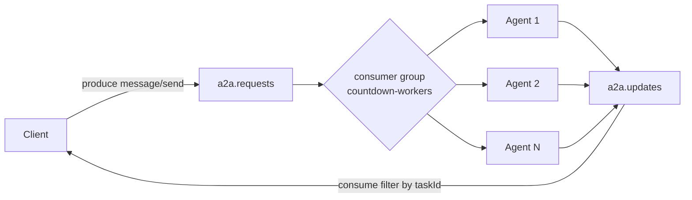
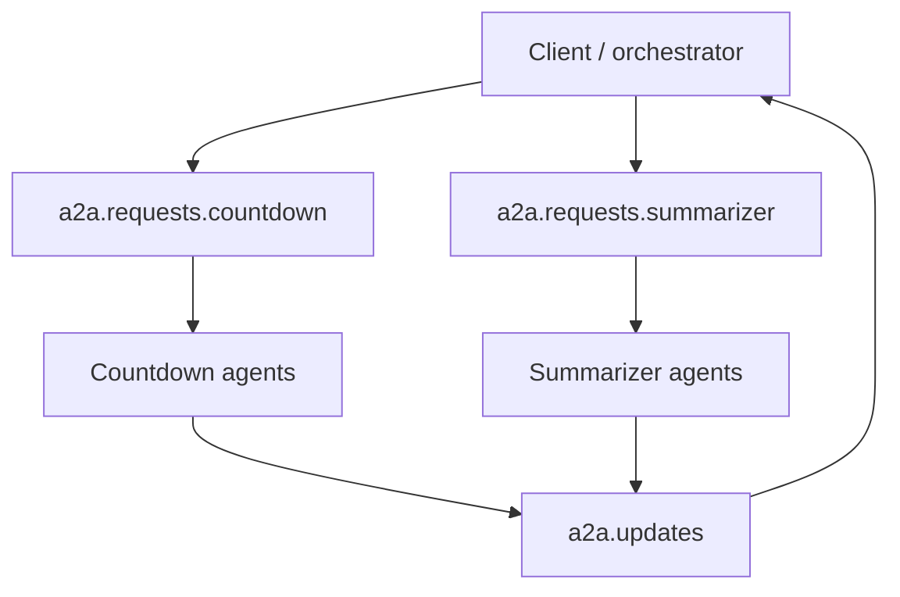
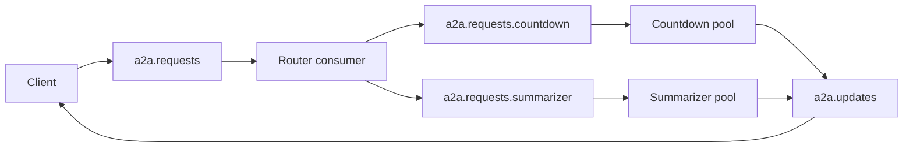
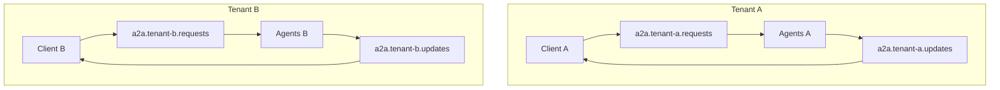

# A2A Kafka

A **Kafka transport implementation** of the [Agent2Agent (A2A) Protocol](https://a2a-protocol.org/). A2A enables interoperability between AI agents; this project maps A2A concepts to Kafka topics and messages so agents can communicate asynchronously via Kafka instead of (or in addition to) HTTP.

## Protocol mapping

| A2A concept | Kafka topic | Description |
|-------------|-------------|-------------|
| **Client → Agent** (message/send, tasks/cancel) | `a2a.requests` | Requests keyed by `taskId` or `sessionId` for ordering |
| **Agent → Client** (status, messages, artifacts) | `a2a.updates` | Status updates, artifact events, full Task results; key = `taskId` |
| **Discovery** | `a2a.agent-cards` | Agent Card announcements; key = agent URL or id |

Each Kafka record value is a **JSON envelope** (JSON-RPC 2.0 style) with:

- `jsonrpc`: `"2.0"`
- `method`: e.g. `message/send`, `status-update`, `artifact-update`, `task`, `agent-card`
- `params` (for requests) or `result` (for responses/events)
- `id`, `timestamp`

This preserves A2A’s request/response and event semantics while using Kafka for transport.

## Diagrams

| Diagram | PNG | SVG | Word (4×) | Source |
|---------|-----|-----|-----------|--------|
| **RR · stream · notify — parallel sequence** (recommended) | [PNG](docs/diagrams/a2a-kafka-rr-stream-notify-par.png) | [SVG](docs/diagrams/a2a-kafka-rr-stream-notify-par.svg) | [Word PNG](docs/diagrams/a2a-kafka-rr-stream-notify-par-word.png) | [`.mmd`](docs/diagrams/a2a-kafka-rr-stream-notify-par.mmd) |
| **RR · stream · notify — slide cards** (3 mini sequences) | [1 RR](docs/diagrams/a2a-kafka-rr-stream-notify-card-1-rr.png) · [2 stream](docs/diagrams/a2a-kafka-rr-stream-notify-card-2-stream.png) · [3 notify](docs/diagrams/a2a-kafka-rr-stream-notify-card-3-notify.png) | — | — | [`docs/diagrams/README.md`](docs/diagrams/README.md) |
| **RR · stream · notify — column flowchart** (alternate) | [PNG](docs/diagrams/a2a-kafka-rr-stream-notify.png) | [SVG](docs/diagrams/a2a-kafka-rr-stream-notify.svg) | [Word PNG](docs/diagrams/a2a-kafka-rr-stream-notify-word.png) | [`.mmd`](docs/diagrams/a2a-kafka-rr-stream-notify.mmd) |
| **Kafka transport POC** — countdown on topics (`requests` → `updates` → audit) | [PNG](docs/diagrams/a2a-kafka-transport-poc.png) | [SVG](docs/diagrams/a2a-kafka-transport-poc.svg) | [Word PNG](docs/diagrams/a2a-kafka-transport-poc-word.png) | [`.mmd`](docs/diagrams/a2a-kafka-transport-poc.mmd) |
| **Transport vs backbone** — this POC (Kafka **is** the wire) vs Part 8 (Kafka **behind** HTTP push) | [PNG](docs/diagrams/a2a-kafka-transport-vs-backbone.png) | [SVG](docs/diagrams/a2a-kafka-transport-vs-backbone.svg) | [Word PNG](docs/diagrams/a2a-kafka-transport-vs-backbone-word.png) | [`.mmd`](docs/diagrams/a2a-kafka-transport-vs-backbone.mmd) |

Index: [`docs/diagrams/README.md`](docs/diagrams/README.md) · Regenerate: [`docs/diagrams/export-png.sh`](docs/diagrams/export-png.sh)

Same diagram sources are mirrored in the series repo: [`scaling-agent-systems-kafka-a2a/docs/diagrams/`](../Applications/Experiments/scaling-agent-systems-kafka-a2a/docs/diagrams/) (relative path from a sibling clone may differ).

## Spec positioning — custom binding (not standard HTTP streaming)

This POC is an **experimental Kafka transport binding**: A2A-shaped **semantics** on Kafka **topics**, not the normative **HTTP + SSE / webhook** binding used by `a2a-java` and the bridge module.

| | **This POC (Kafka binding)** | **Bridge Part 8 (backbone)** |
|---|------------------------------|------------------------------|
| Wire | Kafka (`a2a.requests`, `a2a.updates`) | HTTP JSON-RPC + push webhook |
| Kafka role | **Is** the A2A transport | **Behind** HTTP after webhook |
| Generic A2A client interop | **No** — need Kafka client/agent | **Yes** — standard SDK clients |
| Streaming (SSE) | Collapsed into **consume `a2a.updates`** | **HTTP SSE** on agent (Part 6 Phase B) |

**What we claim**

- A **custom binding** both peers implement — map operations to topics and JSON-RPC envelopes.
- Future: Agent Card `supportedInterfaces[]` with a Kafka `protocolBinding` and topic metadata (see [Follow-up TODO — discovery and topic binding](#follow-up-todo--discovery-and-topic-binding)).

**What we do not claim**

- Drop-in replacement for **HTTP SSE streaming** or **A2A push webhooks** on standard agents.
- Interoperability with off-the-shelf `a2a-java` clients without a Kafka transport layer.
- A registered standard binding in the official A2A specification today.

**Can Kafka replace SSE and stay spec-compliant?** Not for interoperable HTTP A2A clients (**meaning C**). For a closed Kafka-native mesh, this POC targets **meaning B** — a declared custom binding when both sides opt in. For HTTP agents + audit/replay, use the bridge **Part 8 / Part 9** backbone pattern instead.

### Three meanings of “compliant”

| Meaning | Kafka binding on Agent Card |
|---------|----------------------------|
| **A — A2A semantics** (`Task`, envelopes, discovery) | Yes |
| **B — Declared binding** (`supportedInterfaces` + your `protocolBinding`) | Yes, when fully specified and implemented both sides |
| **C — Generic interop** (any `a2a-java` / HTTP SSE client) | **No** |

Full write-up: [`scaling-agent-systems-kafka-a2a/docs/kafka/bindings-and-compliance.md`](../Applications/Experiments/scaling-agent-systems-kafka-a2a/docs/kafka/bindings-and-compliance.md) → section **Custom Kafka binding on Agent Cards** (adjust path if your clone location differs).

---

```bash
cd a2a-kafka
mvn clean package
```

## Structure

- **`model/`** – A2A protocol POJOs: `Task`, `TaskStatus`, `TaskState`, `Message`, `Part` (TextPart, FilePart, DataPart), `Artifact`, `AgentCard`, `MessageSendParams`, `TaskStatusUpdateEvent`, `TaskArtifactUpdateEvent`.
- **`A2AEnvelope`** – Kafka message wrapper (method + params/result + id).
- **`A2AKafkaConfig`** – Topic names (configurable prefix, default `a2a`).
- **`A2AKafkaProducer`** – Send message/send requests, status updates, artifact updates, task results, agent cards.
- **`A2AKafkaConsumer`** – Subscribe to requests/updates/agent-cards, deserialize envelope, dispatch to `A2AMessageHandler`.
- **`Demo`** – Producer example: publish an Agent Card, a message/send request, and a status update.
- **`DemoConsumer`** – Consumer that subscribes to all three topics and prints received A2A messages (for end-to-end demo).
- **`countdown/`** – Part 7–style countdown on Kafka transport: `CountdownKafkaAgent`, `KafkaCountdownClient`, `AuditEventConsumer`, `ReplayEventConsumer`.

## Usage

### Producer (client or agent)

```java
Properties props = new Properties();
props.put("bootstrap.servers", "localhost:9092");
// ... serializers, security, etc.

A2AKafkaConfig config = new A2AKafkaConfig();
try (KafkaProducer<String, String> producer = new KafkaProducer<>(props)) {
    A2AKafkaProducer a2a = new A2AKafkaProducer(producer, config);

    // Client: send message/send
    MessageSendParams params = new MessageSendParams();
    params.setMessage(myMessage);
    a2a.sendMessage(params, taskId);

    // Agent: publish status update
    TaskStatusUpdateEvent event = new TaskStatusUpdateEvent();
    event.setTaskId(taskId);
    event.setStatus(taskStatus);
    a2a.sendStatusUpdate(event);

    a2a.flush();
}
```

### Consumer (agent or client)

```java
A2AKafkaConsumer.A2AMessageHandler handler = new A2AKafkaConsumer.A2AMessageHandler() {
    @Override
    public void onMessageSend(String key, MessageSendParams params) {
        // Handle incoming message/send, e.g. process task and publish status/artifacts
    }
    @Override
    public void onStatusUpdate(TaskStatusUpdateEvent event) {
        // Handle status update from agent
    }
};

KafkaConsumer<String, String> consumer = new KafkaConsumer<>(consumerProps);
A2AKafkaConsumer a2aConsumer = new A2AKafkaConsumer(consumer, config, handler);
a2aConsumer.runRequestsLoop();  // or runUpdatesLoop() / runAllLoop()
```

### End-to-end demo (producer + consumer)

1. **Start the consumer** (terminal 1). It subscribes to `a2a.requests`, `a2a.updates`, and `a2a.agent-cards`, and prints every message:

   ```bash
   cd a2a-kafka
   mvn exec:java@consumer
   ```
   Or: `java -cp "target/classes:target/lib/*" com.example.a2a.kafka.DemoConsumer producer.properties`  
   Stop with Ctrl+C.

2. **Run the producer** (terminal 2). It publishes one Agent Card, one message/send request, and one status update:

   ```bash
   cd a2a-kafka
   mvn exec:java@demo
   ```
   Or: `java -cp "target/classes:target/lib/*" com.example.a2a.kafka.Demo producer.properties`

3. In terminal 1 you should see the consumer print:
   - **AGENT CARD** (name, description, URL, version, capabilities)
   - **MESSAGE/SEND** (role, messageId, text part "Hello from A2A Kafka demo")
   - **STATUS UPDATE** (taskId, state submitted, timestamp)

To run the consumer for ~30 seconds then exit (e.g. to capture one demo run):  
`mvn exec:java -Dexec.mainClass=com.example.a2a.kafka.DemoConsumer -Dexec.args="producer.properties once"`

## Countdown example (Part 7–style on Kafka transport)

End-to-end **async countdown** on shared topics (`a2a.requests`, `a2a.updates`) — same 10-second tick story as the Part 6 bridge, without HTTP/SSE/webhook. Hard-coded topics; no Agent Card lookup.

| Main class | Role | Consumer group |
|------------|------|----------------|
| `CountdownKafkaAgent` | Consumes `message/send`, publishes status/artifact/task | `a2a-countdown-agent` |
| `KafkaCountdownClient` | Produces request, waits for terminal update | `a2a-countdown-client` |
| `AuditEventConsumer` | Fan-out: logs all updates (audit) | `a2a-audit` |
| `ReplayEventConsumer` | New group, `earliest` offset, then exits | `a2a-replay-{id}` |

### Three-terminal run

**Local Kafka:** copy or use `producer.properties.local` (`bootstrap.servers=localhost:9092`, no SASL). Start a broker on **9092**:

```bash
docker compose up -d   # from repo root; see docker-compose.yml
# verify: nc -z localhost 9092
```

Do **not** use `producer.properties` (Instaclustr/SASL) for local runs.

**Instaclustr:** use `producer.properties` (not committed; see `producer.properties.example`).

**Homebrew (macOS, no Docker):** if Kafka is installed via `brew install kafka`, start with `brew services start kafka`. Client port is **9092**. If the service fails with `Address already in use` on **9093**, move the KRaft **CONTROLLER** listener to **9094** in `/opt/homebrew/etc/kafka/server.properties` (`controller.quorum.bootstrap.servers`, `listeners`, `advertised.listeners`), then `brew services restart kafka`.

Pass the config file as the first argument to each main, or override exec args:

```bash
mvn exec:java@agent -Dexec.args="producer.properties.local"
```

1. **Agent** (terminal 1):

   ```bash
   cd a2a-kafka
   mvn exec:java@agent
   ```

2. **Audit** (terminal 2, optional — shows fan-out):

   ```bash
   mvn exec:java@audit
   ```

3. **Client** (terminal 3):

   ```bash
   mvn exec:java@client
   # Or: mvn exec:java -Dexec.mainClass=...KafkaCountdownClient -Dexec.args="producer.properties 60"
   ```

You should see the client print `[client] status-update` lines every ~10s, then `completed`; the agent and audit terminals mirror the same lifecycle.

### Replay

After a run, replay retained events from the log:

```bash
mvn exec:java@replay
```

Uses a fresh consumer group and `auto.offset.reset=earliest` (default listen window: 15 seconds).

### Architecture note

This is **Kafka as A2A transport** (produce request → consume updates), not the bridge Part 7 pattern (HTTP push → webhook → Kafka). The teaching overlap is **durable task lifecycle events**, **fan-out**, and **replay** on `a2a.updates`.

## Configuration

- **Topic prefix**: `A2AKafkaConfig config = new A2AKafkaConfig("my-prefix")` → topics `my-prefix.requests`, `my-prefix.updates`, `my-prefix.agent-cards`.
- **Kafka**: Use the same producer/consumer properties as any Kafka client (bootstrap.servers, security, etc.). Compatible with managed Kafka (e.g. Instaclustr) using SASL_SSL and SCRAM.

## Multi-agent routing

This POC uses **shared topics** (`a2a.requests`, `a2a.updates`, `a2a.agent-cards`). That is enough for a demo and for **homogeneous** agent pools (many copies of the same agent). It does **not** route to a named agent by itself — you choose a pattern below when agents differ by skill, tenant, or ownership.

### How one topic serves many agents

Kafka delivers each record to **one consumer per consumer group**, not to every subscriber on the topic.

```text
a2a.requests
      │
      │  consumer group "countdown-workers"
      │
      ├── Agent-1  (partition 0, 3, …)
      ├── Agent-2  (partition 1, 4, …)
      └── Agent-3  (partition 2, 5, …)

Each message/send → exactly ONE agent in the group (load-balanced).
Add agent instances → add consumers to the same group (horizontal scale).
```

You do **not** need one topic per agent **instance**. Consumer groups give you a worker pool on a single topic.

### What the partition key does

Requests and updates use **`taskId`** (or `sessionId`) as the Kafka record key:

| Key guarantees | Key does *not* guarantee |
|----------------|--------------------------|
| All events for one **task** stay ordered (same partition) | Delivery to a **specific named** agent |
| Parallel tasks spread across partitions | “Send this to the countdown agent, not billing” |

The default demo is a **shared inbox**: produce to `a2a.requests`, any member of the agent consumer group may handle the job. Handlers can ignore irrelevant messages, but the POC does not define a standard `targetAgent` field in the envelope.

### Pattern 1 — Homogeneous worker pool (benchmarks, same agent type)

Use when every agent instance is **interchangeable** (e.g. N countdown workers).



| Setting | Value |
|---------|--------|
| Request topics | **1** shared `a2a.requests` |
| Agent consumer group | **1** group; all worker instances join it |
| Updates | **1** shared `a2a.updates`; client consumes with its own group and filters by `taskId` |
| Scale-out | Increase consumer count in the worker group |

This is the intended layout for throughput benchmarks with identical agents.

### Pattern 2 — Heterogeneous agents (different skills / types)

Use when agents are **not** fungible (countdown vs summarizer vs planner).

**Option A — topic per agent type** (simple, explicit):



Configure separate topic prefixes, e.g. `new A2AKafkaConfig("a2a.countdown")` vs `new A2AKafkaConfig("a2a.summarizer")`, or extend `A2AKafkaConfig` with custom topic names.

**Option B — router / dispatcher** (one client-facing topic):



The router reads the shared inbox, inspects the envelope (skill, agent id, Agent Card reference), and produces to the appropriate downstream topic. Agents only subscribe to their type’s topic.

**Option C — single topic + filter in handler** — all agent types share `a2a.requests` and skip non-matching messages. Easiest to prototype; wasteful at scale (every agent reads every request).

| Option | Pros | Cons |
|--------|------|------|
| Topic per type | Clear ownership, ACLs per topic, no wasted reads | More topics; client must pick topic |
| Router | Single client-facing topic; flexible routing | Extra service to deploy and operate |
| Filter in handler | No infra change | Every agent consumes every request |

### Pattern 3 — Tenancy and isolation

Use when **tenants** (customers, environments) must not share a bus, or when Kafka ACLs should bound access.



Use `A2AKafkaConfig("a2a.tenant-a")` (or per-tenant prefix) so topic names and ACLs align. Same worker-pool rules apply **within** each tenant’s requests topic.

### Updates topic and fan-out

`a2a.updates` is usually **one shared topic** keyed by `taskId`, even when request topics are split by agent type or tenant. Multiple readers use **different consumer groups**:

```text
Agent produces → a2a.updates (key=taskId)
                      │
        ┌─────────────┼─────────────┐
        ▼             ▼             ▼
   group:client   group:audit   group:orchestrator
   (wait for      (copy of       (situational
    one task)      everything)    awareness)
```

### Quick chooser

| Scenario | Request topics | Agent instances |
|----------|----------------|-----------------|
| Benchmark: N identical countdown agents | 1 × `a2a.requests` | N consumers, **same** consumer group |
| Production: several agent **types** | 1 per type, or 1 + router | 1 group per type |
| Production: multi-tenant isolation | 1 requests topic **per tenant** (prefix) | Pool per tenant |
| One topic per agent **pod** | Rarely needed | Scale via consumer group size instead |

### POC scope note

The code in this repo implements **Pattern 1** only (shared topics, no targeting field, no router). For heterogeneous or multi-tenant layouts, reuse `A2AKafkaProducer` / `A2AKafkaConsumer` with different `A2AKafkaConfig` prefixes or extended topic names — no code changes required for topic-per-type or topic-per-tenant; a router would be a separate small service.

## Throughput benchmark (initial experiment)

HTTP A2A vs this Kafka POC is compared in the **scaling-agent-systems** repo:

[`benchmark/README.md`](../Applications/Experiments/scaling-agent-systems-kafka-a2a/benchmark/README.md) (adjust path if your clone location differs)

| v1 choice | Detail |
|-----------|--------|
| Agent scale-out | **Same** consumer group on shared `a2a.requests` — not one topic per agent |
| Partitions | Create ≥12 on `a2a.requests` before concurrency sweeps (`benchmark/scripts/create-kafka-topics.sh`) |
| Client scale-out | Shared `a2a.updates` with per-client consumer groups — **fan-out** distorts results above ~20 concurrent clients |

See `benchmark/docs/SCALABILITY.md` and `./scripts/run-initial-experiment.sh` in that module.

## Follow-up TODO — discovery and topic binding

**Problem:** With **topic-per-agent-type** (Pattern 2), clients must resolve **card → Kafka topics**. The current demo publishes Agent Cards to `a2a.agent-cards` with a placeholder `url: "kafka://a2a"` and no actionable binding — clients must hard-code topic names.

**Goal:** Spec-aligned discovery, closer to standard A2A: find a card, read transport metadata, produce/consume on the correct topics.

### Two-layer discovery model

```text
Layer 1 — Find cards              Layer 2 — Resolve transport
────────────────────              ─────────────────────────────
Consume a2a.agent-cards      OR   Read supportedInterfaces[]
Query HTTP registry               Find Kafka protocolBinding
Filter by skill / tags            Extract requestsTopic, updatesTopic
Build catalog                     Produce/consume on those topics
```

### Target Agent Card shape (sketch)

Extend published cards with A2A v1.0-style interfaces plus Kafka-specific metadata:

```json
{
  "name": "Countdown Kafka Agent",
  "skills": [{ "id": "countdown", "tags": ["countdown", "timer"] }],
  "capabilities": { "streaming": true },
  "supportedInterfaces": [
    {
      "url": "kafka://cluster/a2a.countdown",
      "protocolBinding": "https://instaclustr.com/a2a/bindings/kafka/v1",
      "protocolVersion": "1.0"
    }
  ],
  "extensions": {
    "kafka": {
      "requestsTopic": "a2a.countdown.requests",
      "updatesTopic": "a2a.updates",
      "agentCardsTopic": "a2a.agent-cards"
    }
  }
}
```

Even with **requests topic per type**, **`a2a.updates` can stay shared** (key = `taskId`); clients filter by task id in the handler.

### Discovery options (pick one or combine)

| Option | Layer 1 | Notes |
|--------|---------|--------|
| **A — Kafka-only** | Consume `a2a.agent-cards` | Fully async; client still needs bootstrap config for that topic |
| **B — HTTP registry** | `GET /.well-known/...` returns card JSON | Most spec-like; static JSON or small registry service |
| **C — Hybrid** | HTTP catalog + Kafka announcements | HTTP for lookup; `agent-cards` for live “agent online” events |

### Implementation checklist

- [ ] **`KafkaTransportBinding` POJO** — `requestsTopic`, `updatesTopic`, optional `bootstrapServers` / `agentCardsTopic`
- [ ] **Enrich `AgentCard` model** — `supportedInterfaces[]` + `extensions.kafka` (or encode topics in interface `url`)
- [ ] **Update agent publish path** — `publishAgentCard()` includes binding when using topic-per-type prefix (e.g. `A2AKafkaConfig("a2a.countdown")`)
- [ ] **`AgentCardCatalog`** — in-memory index built from `onAgentCard`: lookup by skill id, tag, or name
- [ ] **`KafkaA2AClient`** — `discover(skillId)` → resolve topics → `sendMessage()` + consume updates until terminal
- [ ] **Document bootstrap chicken-and-egg** — client config supplies `bootstrap.servers` + `agentCardsTopic`; all other topic names come from cards
- [ ] **Optional: HTTP registry** — thin well-known endpoint for card list/search (defer if Kafka-only is enough for v2)

### Client flow (target)

```text
1. Discover   → consume agent-cards OR GET registry; filter skill.id == "countdown"
2. Resolve    → card.extensions.kafka.requestsTopic / updatesTopic
3. Submit     → produce message/send to requestsTopic (key = taskId)
4. Await      → consume updatesTopic; match taskId until final task / status
```

Analogous to HTTP A2A: `getAgentCard()` → `SendMessage(card.url)`, except the binding yields **topic names** instead of an HTTP base URL.

## Pushing to GitHub (devrel-internal-code-samples)

To add this project under `pbrebner/` in [instaclustr/devrel-internal-code-samples](https://github.com/instaclustr/devrel-internal-code-samples):

1. **Use the script** (from a terminal where you’re authenticated with GitHub):

   ```bash
   cd /path/to/a2a-kafka
   chmod +x push-to-github.sh
   ./push-to-github.sh
   ```

   The script clones the repo (or pulls), copies this project to `pbrebner/a2a-kafka`, then commits and pushes. `producer.properties` is not copied (so secrets stay local).

2. **Or do it manually:**

   ```bash
   git clone https://github.com/instaclustr/devrel-internal-code-samples.git
   cd devrel-internal-code-samples
   mkdir -p pbrebner
   cp -r /path/to/a2a-kafka pbrebner/   # omit producer.properties if it has secrets
   git add pbrebner/a2a-kafka
   git commit -m "Add a2a-kafka under pbrebner: A2A protocol over Kafka"
   git push origin main
   ```

## References

### A2A protocol

- [A2A Protocol Specification](https://a2a-protocol.org/latest/)
- [A2A Key Concepts](https://a2a-protocol.org/topics/key-concepts/) (Task, Message, Artifact, Agent Card)
- [Streaming and async](https://a2a-protocol.org/latest/topics/streaming-and-async/) (HTTP SSE / push — contrast with this POC)

### This repo

- [Diagrams](docs/diagrams/README.md) — PNG, SVG, Mermaid sources
- [Talk outline](TALK_OUTLINE.md)

### Related series repo (`scaling-agent-systems-kafka-a2a`)

Paths below assume a sibling clone at `../Applications/Experiments/scaling-agent-systems-kafka-a2a/` (adjust if yours differs).

| Topic | Doc |
|-------|-----|
| HTTP vs Kafka transport vs backbone | [`docs/kafka/bindings-and-compliance.md`](../Applications/Experiments/scaling-agent-systems-kafka-a2a/docs/kafka/bindings-and-compliance.md) |
| Part 8 Atomic Timekeeper (Kafka behind push) | [`part8/README.md`](../Applications/Experiments/scaling-agent-systems-kafka-a2a/part8/README.md) |
| HTTP vs Kafka benchmark | [`benchmark/README.md`](../Applications/Experiments/scaling-agent-systems-kafka-a2a/benchmark/README.md) |
| Default A2A on official SDK (Quartz Chronometer) | [`quartz-chronometer/README.md`](../Applications/Experiments/scaling-agent-systems-kafka-a2a/quartz-chronometer/README.md) |
| Series naming | [`docs/SERIES-NAMING.md`](../Applications/Experiments/scaling-agent-systems-kafka-a2a/docs/SERIES-NAMING.md) |

