# Scaling Agent Systems, Part 2: A2A — The Object Model

*A2A separates discovery (Agent Card), dialogue (Message/Part), and deliverables (Task/Artifact).*

You've probably heard this famous "quote" about computing standards:

> "The wonderful thing about standards is that there are so many of them to choose from."

Widely attributed to Grace Hopper or Andrew Tanenbaum, it captures a recurring industry pattern: competing guidelines, overlapping specs, and integration fatigue.

In the emerging agent interoperability space, the picture is slightly different. There are not yet many **bona fide open protocols** purpose-built for agent collaboration. What you mostly find today is a mix of:

- **Interop protocols** — notably [A2A](https://a2a-protocol.org/latest/) (agent-to-agent) and [MCP](https://modelcontextprotocol.io/) (agent-to-tools)
- **Frameworks and platforms** — LangGraph, AutoGen, CrewAI, AGNTCY, vendor SDKs, and similar stacks
- **API description formats** — OpenAPI, GraphQL, AsyncAPI, and others that teams sometimes adapt for agent handoffs

This post focuses on **A2A** — specifically the **nouns** of the protocol: who participates, and what data objects carry meaning. [Part 3](scaling-agents-part-3-a2a-runtime.md) covers how agents discover each other, send work, and deliver updates. [Part 4](TODO-part-4-link) will add diagrams and walk through lifecycles with concrete traces.

---

## What is A2A?

The **Agent2Agent (A2A) Protocol** is an open interoperability standard for AI agents built on different frameworks, platforms, and languages to discover one another, exchange structured messages, track long-running work, and deliver durable outputs — securely and without sharing internal state.

Initiated at Google and now community-driven under the [A2A project](https://a2a-protocol.org/latest/), A2A aims to let specialised multi-agent systems pass tasks, context, and generated artifacts across vendor silos. The specification and topic guides are published at [a2a-protocol.org](https://a2a-protocol.org/latest/).

In plain terms, A2A is:

- An **open standard protocol**
- For **communication and interoperability**
- Between **opaque agentic applications** (agents that do not expose their internal reasoning, memory, or tooling)

### A2A is not MCP (and that is fine)

Teams often conflate the two. They solve adjacent problems:

| Protocol | Scope | Typical use |
|----------|-------|-------------|
| **MCP** | Agent ↔ tools/resources | Calling databases, APIs, file systems, IDE integrations |
| **A2A** | Agent ↔ agent | Delegating work, collaborating across runtimes and teams |

You will likely use both in production: MCP for tool access inside an agent, A2A for handoffs between agents.

### Continuing the interoperability story from Part 1

In [Part 1](TODO-link-to-part-1), I argued that interoperability has been a recurring challenge in distributed systems — addressed over decades through technologies like TCP, CORBA, the Web, SOA, and event streaming platforms such as Apache Kafka. A2A continues that evolution at a new layer: **autonomous agents as network-accessible collaborators**.

It also targets a challenge I highlighted earlier: **complex workflows involving long-running, stateful agents** with greater autonomy. A2A introduces asynchronous execution, long-running operations (LROs), streaming, and push notifications — topics we pick up in [Part 3](scaling-agents-part-3-a2a-runtime.md). Those patterns will feel familiar if you have worked with distributed workflow engines (Cadence, Temporal) or event-driven architectures; they are analogies, not native A2A integrations.

---

## Core participants

The [A2A key concepts](https://a2a-protocol.org/latest/topics/key-concepts/) documentation describes three roles. When the spec says "actors," it means **protocol participants**, not the classic Erlang/Akka Actor concurrency model.

| Role | Description |
|------|-------------|
| **User** | The end user — human or automated service — who initiates a goal or request. The User is not an A2A wire endpoint, but they are part of the interaction model: a Client Agent acts on their behalf. |
| **A2A Client (Client Agent)** | An application or agent that **initiates** communication using the A2A protocol — for example, an orchestrator delegating work to a specialist agent. |
| **A2A Server (Remote Agent)** | An agent that **implements** an A2A endpoint: receives requests, executes work, returns messages or tasks, and emits status updates. Internal reasoning and tools remain opaque to the client. |

---

## Communication elements

These are the core data objects defined in the specification. Together they describe **who** agents are, **what** is being exchanged, and **what** gets produced.

### Agent Card

A JSON metadata document — think digital business card, or WSDL for agents — that describes a remote agent's identity, service endpoint, capabilities, authentication requirements, and skills. Clients fetch an Agent Card before sending work so they know *who* they are talking to and *how* to talk to them. Discovery strategies, security, and caching are covered in [Part 3](scaling-agents-part-3-a2a-runtime.md).

### Task

A **stateful unit of work** with a unique ID and a defined lifecycle. Tasks are created when a client sends a message and the remote agent determines the work requires ongoing execution rather than an immediate reply. Tasks can be grouped under a **`contextId`** to relate multiple interactions in the same session.

Common task states include `submitted`, `working`, `input-required`, and terminal outcomes such as `completed`, `failed`, `canceled`, and `rejected`. (Exact naming is defined in the spec — use the protocol enums in code, not ad hoc strings.)

### Message

A single turn in the interaction between client and agent. Each message has a **role** (`user` or `agent`), a unique message ID, and one or more **parts** carrying the actual content — instructions, context, status updates, and so on.

### Part

A typed content container used within messages and artifacts. Each part holds **exactly one** form of data: plain text, raw bytes, a URI reference to external content, or structured JSON. Parts can include a `mediaType`, optional filename, and arbitrary metadata. This design keeps A2A **modality-independent** — a single message can combine text, structured data, and file references without ambiguity.

### Artifact

Output generated by an agent during a task — the deliverables you keep after the conversation ends. Artifacts have identifiers, human-readable names, and are composed of parts. They can be built and streamed incrementally, and they remain bound to the task lifecycle: created, updated, and finalised as work progresses.

---

## Messages, parts, and artifacts — how they fit together

A useful way to read the object model:

- **Messages coordinate** — they are the dialogue between client and agent (or between agents). They drive the work forward, request input, and report interim status.
- **Artifacts deliver** — they are structured, referenceable outputs: a report, a dataset, generated code, an image, a UI component, or any other work product.
- **Parts carry the payload** in both cases — the same compositional pattern applies to conversational turns and to durable outputs.

For example, an agent generating a sales analysis might exchange several messages while work is in progress, then produce an artifact named "Sales Analysis Report" (`report-456`) containing a text summary part and a structured table part. Downstream systems consume the artifact directly instead of parsing chat history.

This separation matters for three practical reasons:

1. **Decoupling dialogue from deliverables** — if everything were a message, extracting final results would mean mining conversation logs.
2. **Streaming and incremental construction** — artifacts composed of parts can be delivered piece by piece during long-running work.
3. **Persistence and reuse** — artifacts are designed to be stored, versioned, and passed to other agents or systems; messages are typically ephemeral coordination traffic.

Similar ideas appear elsewhere: MCP treats tool outputs as addressable resources; older integration stacks (BPEL, WS-Addressing, ebXML) also distinguished **process chatter** from **business documents**. A2A applies the pattern to agent collaboration.

One detail that tripped me up on first read: `SendMessage` returns a **`Message` or a `Task`**, not a bare `Artifact`. Artifacts live **inside the Task**. More on that in [Part 3](scaling-agents-part-3-a2a-runtime.md).

**Diagram (detail):** `docs/diagrams/a2a-object-model-simple.svg` — full object relationships for implementers.

---

## What to take away

Before diving into runtime behaviour, anchor on the vocabulary:

- **Three participants** — User (goal), Client Agent (initiates), Remote Agent (serves)
- **Agent Card** — JSON capability and trust metadata for discovery
- **Message + Part** — one conversational turn, modality-independent
- **Task** — stateful unit of work with a lifecycle
- **Artifact** — durable deliverable, composed of parts, bound to a task

**Next:** [Part 3 — Discovery, Tasks, and Streaming](scaling-agents-part-3-a2a-runtime.md) — how clients find agents, send work via `SendMessage`, track long-running tasks, and receive updates through polling, SSE, or push webhooks.

---

## References

- [A2A Protocol — home](https://a2a-protocol.org/latest/)
- [Key concepts](https://a2a-protocol.org/latest/topics/key-concepts/)
- [Life of a task](https://a2a-protocol.org/latest/topics/life-of-a-task/) (runtime detail — also covered in Part 3)
