# Scaling Agent Systems, Part 3: A2A — Discovery, Tasks, and Streaming



*Discover an agent, send work, then poll, stream, or receive push updates for long-running tasks.*

> **From [Part 2](scaling-agents-part-2-a2a-intro.md):** A2A's object model centres on **Agent Card**, **Task**, **Message**, **Part**, and **Artifact**. A client sends messages; the remote agent responds with an immediate **Message** or a stateful **Task**. Artifacts — the durable outputs — live on the Task, not as a separate top-level response type.

This post covers the **verbs**: how agents find each other, how work flows at runtime, and the confusions that surfaced when I first read the specification. [Part 4](TODO-part-4-link) will add sequence and state diagrams plus concrete request/response traces.

---

## Interaction mechanisms

A2A supports three patterns for short and long-running work. All map to the same core operations (`SendMessage`, `GetTask`, `CancelTask`, and others) but differ in how updates reach the client. See the [streaming and async](https://a2a-protocol.org/latest/topics/streaming-and-async/) topic for normative detail.

### 1. Request/response and polling

The simplest path: the client sends a message and receives either:

- an immediate **Message** (stateless, complete in one step), or
- a **Task** (stateful, long-running)

For LROs, the client polls `GetTask` to retrieve status, history, and artifacts until the task reaches a terminal state. Polling is always available as a baseline; it is straightforward but can be chatty at scale.

### 2. Streaming (Server-Sent Events)

For real-time progress, A2A uses **Server-Sent Events (SSE)** — a long-lived HTTP response where the **server** pushes incremental updates to the client.

Key points:

- SSE is **unidirectional** (server → client). The client still sends work via normal A2A requests such as `SendMessage`.
- **`SendStreamingMessage`** streams updates for a message-level interaction.
- **`SubscribeToTask`** lets a client re-attach to an in-flight task after a connection drop — the server replays missed events where possible.

A stream emits a `StreamResponse` that is exactly one of: `task`, `message`, `statusUpdate`, or `artifactUpdate` — so messages, status, and artifact chunks can all appear on the same stream.

SSE runs over standard HTTP/1.1 or HTTP/2, which makes it proxy- and firewall-friendly compared with bespoke WebSocket setups. For background on the mechanism, see [MDN's SSE guide](https://developer.mozilla.org/en-US/docs/Web/API/Server-sent_events).

### 3. Push notifications

For disconnected clients or LROs where polling and streaming are impractical, the server can send **asynchronous notifications** to a client-configured webhook (a Push Notification Service).

- The client registers a config via **`CreateTaskPushNotificationConfig`** (and related list/get/delete operations).
- When task state changes, the server POSTs to the webhook.
- The client then calls **`GetTask`** to fetch the full updated state.

**Direction of “push”:** In A2A, *push* means the **agent server** sends **unsolicited HTTP POSTs** to a URL the client registered — typically when task state changes. That is **server → client** only.

The client does **not** get a symmetric “push channel” back to the agent. Anything the client sends — including registering that webhook URL — is still a **normal A2A request** (`SendMessage`, `CreateTaskPushNotificationConfig`, etc.) over JSON-RPC/REST/gRPC. Think: **client pulls/pushes work via RPC; server pushes status via webhook.**

**Could Kafka implement this?** Not as an A2A protocol binding — Kafka is not one of the standard transports. But Kafka (or any durable event log) could sit **behind** a webhook receiver or notification service in your architecture. That is an implementation pattern beyond the spec, and it is exactly the kind of mapping this series will explore in later parts.

---

## Agent Cards in practice

Agent Cards are the discovery and trust layer. Before any task is sent, a client needs to answer: *Who is this agent? What can it do? How do I authenticate? Which transport should I use?*

Discovery strategies defined in the [agent discovery](https://a2a-protocol.org/latest/topics/agent-discovery/) documentation include:

1. **Well-Known URI (recommended for broad discovery)** — fetch `https://{agent-domain}/.well-known/agent-card.json` (RFC 8615).
2. **Curated registries** — enterprise directories or marketplaces where agents publish cards and clients search by skill, tag, or provider. The spec does not yet standardise a registry API.
3. **Direct configuration** — the client is pre-configured with an Agent Card URL or JSON — common in development and tightly coupled deployments.

An Agent Card is JSON with a schema defined in the specification. Typical fields include identity, service URL, capabilities (streaming, push notifications), authentication schemes, skills, and **`supportedInterfaces`** (URL + `protocolBinding` + protocol version for each transport).

Agent Cards can contain sensitive information (internal URLs, restricted skills). The spec recommends protecting card endpoints with authentication, network controls, or selective disclosure via registries — and using dynamic credentials rather than embedding static secrets in the card.

Cards change infrequently (new skills, auth updates). Standard HTTP caching (`Cache-Control`, `ETag`) applies; clients should honour conditional requests rather than re-fetching on every call.

---

## Life of a task

When a remote agent receives a message, it has two fundamental response paths:

**Immediate message** — for short, self-contained interactions. The agent returns a `Message` and the exchange is complete. No task state to track.

**Stateful task** — for work that takes time, requires multiple turns, or may need additional input. The agent returns a `Task` and executes it over a lifecycle: progress updates, streaming or push notifications, possible `input-required` pauses, and eventually a terminal state with artifacts.

This dual response model is central to A2A. Client code should treat "got a Message" and "got a Task" as **equally normal** branches of `SendMessage`, not as rare edge cases.

Implementers also choose agent **personalities** that affect what you see in the wild:

- **Message-only agents** — always return messages; use `contextId` to tie turns together.
- **Task-only agents** — always return tasks, even for simple replies (modelled as already-completed tasks).
- **Hybrid agents** — negotiate scope with messages, then commit to a task for tracked execution.

Once a task reaches a terminal state (`completed`, `failed`, `canceled`, `rejected`), it is **immutable** — follow-up work starts a new task, often in the same `contextId` with `referenceTaskIds` pointing at the prior task.

Understanding the full lifecycle — especially `input-required` loops and terminal state handling — gets tricky quickly. Part 4 will walk through sequence and state diagrams to make it concrete.

**Diagram (detail):** `docs/diagrams/a2a-task-lifecycle-strict.svg` · `docs/diagrams/a2a-runtime-sequence.svg`

---

## Protocol bindings and transport

A2A separates **what** agents say from **how** it is transported. The specification defines three standard **protocol bindings** that map abstract operations to concrete transports:

| Binding | Notes |
|---------|-------|
| **JSON-RPC 2.0** over HTTPS | Common default in SDKs and examples |
| **gRPC** | Unary and streaming RPC mappings |
| **HTTP+JSON / REST** | Resource-oriented endpoints; SSE for streaming operations |

Agents declare supported bindings in the Agent Card's `supportedInterfaces` list. Clients parse entries in preference order and select the first binding they support. Custom bindings (WebSocket, MQTT, and others) are permitted under the project's governance process — they change the transport, whereas [extensions](https://a2a-protocol.org/latest/topics/extensions/) add behaviour on top of an existing binding.

---

## Deployment — beyond the specification

Agent **deployment topology is not defined by A2A**. The protocol standardises the communication layer; how you host, scale, and secure agents is up to you. That said, a typical pattern looks like this:

1. **Wrap and expose** — an existing agent is wrapped as an A2A-compatible server, often using a framework SDK or Agent Development Kit (ADK) that handles protocol details.
2. **Deploy as a network service** — commonly an HTTPS endpoint (container, VM, or serverless function) with TLS and token-based authentication.
3. **Publish an Agent Card** — describing skills, capabilities, auth requirements, and supported interfaces.
4. **Discover and delegate** — a client agent retrieves the card, sends a structured request, tracks the resulting task or message, and consumes artifacts.

In effect, A2A turns agents into **loosely coupled distributed services** that can discover each other, delegate work, and exchange results without a shared runtime or monolithic platform. Your choice of orchestrator, event backplane, and observability stack sits outside the protocol — which is where Kafka, workflow engines, and gateway layers enter the picture in later parts of this series.

There is no separate "Auth Server" actor in the protocol. Authentication schemes are declared on the Agent Card; an OAuth or identity provider is external infrastructure. It is fine to describe deployment as "Step 0" in your own architecture, but label it as implementation, not normative protocol text.

---

## Reader's notes: common first-read confusions

When I first read the A2A specification, several things did not slot into place immediately. The protocol *is* defined — but it separates concerns in ways that differ from how many of us sketch agent systems on a whiteboard. The points below are the ones I had to re-read to get straight; they may save you the same round trip.

### Where do artifacts appear in the response?

`SendMessage` and `SendStreamingMessage` return a **`Message` or a `Task`** — not a bare `Artifact` at the top level. Artifacts live **inside the `Task`** (and can arrive incrementally via `TaskArtifactUpdateEvent` on a stream). A completed task response includes an `artifacts` array; during `working`, that array may still be empty. Think of it as: **Message/Task = response envelope; Artifact = deliverable payload on a task.**

### Is there a separate authentication or deployment step in the protocol?

Not as distinct lifecycle phases. **Authentication** schemes are declared on the Agent Card; the client applies them on **every** request. **Deployment** is outside the normative spec — see the section above.

### User vs Client Agent — who speaks A2A?

The **User** (human or automated service) initiates the goal. The **Client Agent** speaks the A2A protocol on their behalf. The User is a first-class concept in the interaction model but is not an A2A wire endpoint.

### "Core Actors" — is this the Actor concurrency model?

No. When the spec says **actors**, it means **protocol roles** (User, Client, Server). It is not referring to Erlang, Akka, or message-passing concurrency.

### Can messages be streamed, or only artifacts?

Both can appear on a stream via `SendStreamingMessage`. The distinction between messages and artifacts is **semantic** (coordination vs durable work product), not "messages never stream." Artifacts additionally support chunked delivery (`append`, `lastChunk` on artifact update events).

### How many artifacts can a task produce?

A task carries an **`artifacts` array** — zero or more over its lifetime. Each artifact must contain **at least one part**. Multiple artifacts per task are normal (e.g. a report plus a chart).

### Client-to-server push notifications?

**No.** A2A push is **server → client** only: the agent POSTs task updates to a **client-owned webhook** when state changes.

That does **not** mean the client is passive. The client still **initiates** everything on the A2A side — `SendMessage`, `CreateTaskPushNotificationConfig`, `GetTask`, and so on — via the usual request/response API. Registering a webhook URL is an RPC call, not “client push.” There is no spec-defined mirror where the client POSTs unsolicited task updates to the agent.

```text
Client  --RPC-->  Agent     (SendMessage, register webhook, GetTask, …)
Client  <--POST--  Agent     (push notification when task state changes)
```

### Could push — or the whole update path — be Kafka-only?

Kafka is **not** an A2A protocol binding. It can sit **behind** a webhook receiver, notification service, or event backplane — an implementation pattern this series will revisit.

### Is there a "subscribe to an agent" model?

**Not in the base protocol.** Work is **client-initiated**. You can approximate a standing subscription with a long-running task that rarely completes and streams artifact parts over time, but that is a pattern, not first-class pub/sub. Fan-out event feeds fit an event backbone like Kafka better than they fit A2A natively.

### Is there a "life of an agent" state machine?

**No.** The spec defines **task** lifecycle only. Agent availability is implied by deployment and the Agent Card, not by protocol-level agent states.

### How does the protocol extend without forking?

Through **[Extensions](https://a2a-protocol.org/latest/topics/extensions/)** (URI-identified capabilities on the Agent Card) and **custom protocol bindings** (alternative transports). See also the bindings section above.

### How are errors handled?

The spec defines error categories (authentication, authorization, validation, not found, system) and A2A-specific types such as `ContentTypeNotSupportedError` and `VersionNotSupportedError`, mapped per binding to HTTP status codes, JSON-RPC errors, or gRPC status.

### Service meshes?

A2A does not define or require a service mesh. It is an **application-layer interop contract**. A mesh may sit underneath for mTLS, routing, and observability.

### Historical analogies — how far do they go?

Comparisons to SOA, ebXML, BPEL, WS-Addressing, MCP resources, Cadence workflows, or blackboard multi-agent systems are **useful mental models**, not structural equivalence.

---

## What to take away

At runtime, A2A orchestrates work through a small set of patterns:

- **Discover** via Agent Card (well-known URI, registry, or direct config)
- **Send** via `SendMessage` — expect **Message or Task** in response
- **Track** long-running work via polling (`GetTask`), streaming (`SendStreamingMessage`, `SubscribeToTask`), or push webhooks
- **Consume** artifacts from the completed task

It complements MCP (tools) rather than replacing it, and it standardises the agent conversation layer — not deployment, agent fleet lifecycle, or your event backplane.

**Next:** Part 4 — diagrams for the object model, runtime sequence, and task lifecycle, plus a closer look at how these patterns map to event streaming and production deployment.

---

## References

- [A2A Protocol — home](https://a2a-protocol.org/latest/)
- [Key concepts](https://a2a-protocol.org/latest/topics/key-concepts/)
- [Life of a task](https://a2a-protocol.org/latest/topics/life-of-a-task/)
- [Streaming and async operations](https://a2a-protocol.org/latest/topics/streaming-and-async/)
- [Agent discovery](https://a2a-protocol.org/latest/topics/agent-discovery/)
- [Extensions](https://a2a-protocol.org/latest/topics/extensions/)
- [MDN — Server-Sent Events](https://developer.mozilla.org/en-US/docs/Web/API/Server-sent_events)
- [Part 2 — The Object Model](scaling-agents-part-2-a2a-intro.md)
