# Scaling Agent Systems, Part 5: The Clockwork Agent — Three A2A Paths in Java



*The map for this post — the **Clockwork Agent** in plain Java (classes `A2aDemoClient` / `A2aDemoServer`), no LLM.*

The figure above is where we start. The client fetches an **Agent Card** for the **Clockwork Agent**, then calls **`SendMessage`**. From there the flow splits into three examples — each one a different branch of the A2A runtime we diagrammed in [Part 4](TODO-part-4-link):

- **Ex 1 · Time** — `"What time?"` → immediate **`Message`** (one round trip, done).
- **Ex 2 · Countdown** — `"Count down 60s"` → **`Task`**, **`GetTask`** poll loop, final **`Artifact`**.
- **Ex 3 · Confirm** — `"Count down + confirm"` → **`input-required`**, then **`SendMessage`** again with **`taskId`** → **`working`** → **`completed`**.

Same entry point, three outcomes. That is the fork from [Part 3](scaling-agents-part-3-a2a-runtime.md) and the [runtime sequence](../diagrams/a2a-runtime-sequence.svg), narrowed to what this repository actually runs: plain **`HttpServer`** and **`HttpClient`**, JSON-RPC on `/rpc`, and a deterministic server that pattern-matches text — no model inference, no framework SDK.

[Part 2](scaling-agents-part-2-a2a-intro.md) gave us the nouns; Parts 3 and 4 showed how they behave on the wire. This post makes the Clockwork Agent runnable.

Theory is useful. Running code is better.

This post walks through the **Clockwork Agent** end to end — what each example teaches, where it matches the Part 4 diagrams, and what we left out on purpose. The goal is not production agent infrastructure; it is something you can **clone, run, and break** while the protocol stays in focus.

---

## What the Clockwork Agent is (and is not)

**It is:**

- A teaching harness for A2A **request shapes**, **response forks**, and **task lifecycle** semantics
- Runnable in two terminals with Maven (`A2aDemoServer` + `A2aDemoClient`)
- Accompanied by captured traces in [`docs/examples/trace.md`](../examples/trace.md)

**It is not:**

- An AI agent — there is no model inference, no tool calling, no MCP, no RAG
- The official [`a2a-java`](https://github.com/a2aproject/a2a-java) SDK (use that for production)
- A complete protocol implementation — several operations and transport paths are deliberately omitted

The **Clockwork Agent** is a **deterministic Java server** that pattern-matches on user text (`time`, `count down N seconds`, `confirm`). Mechanical, not intelligent — that is a feature, not a bug: you can see protocol mechanics without model non-determinism obscuring the wire format.

---

## Architecture at a glance

Before the examples, map the Clockwork Agent onto the component diagram from Part 4.



| Diagram component | In this demo |
|---|---|
| Agent Card endpoint | `GET /.well-known/agent.json` |
| A2A API surface | `POST /rpc` — `SendMessage`, `GetTask`, `CancelTask` |
| Task manager | `CountdownTask` + in-memory `TASKS` map |
| Artifact store | Artifacts attached inline on the `Task` when complete |
| Push/stream notifier | **Not implemented** |
| Client SDK / binding | Hand-rolled `HttpClient` + JSON-RPC |
| JSON-RPC binding | Yes — REST and gRPC exist in the spec but are not used here |
| Security boundary | **Not implemented** — no auth on card or RPC |

The demo **collapses** several server-side boxes into one class (`A2aDemoServer.java`). That keeps the story readable. A production service would split card serving, RPC routing, task orchestration, artifact persistence, and notification delivery into separate modules — exactly as the components diagram suggests.

---

## Step zero: discovery

Every client run starts the same way: fetch the Agent Card.

```java
HttpRequest req = HttpRequest.newBuilder(
    URI.create(baseUrl + "/.well-known/agent.json")).GET().build();
```

This corresponds to the top of the [runtime sequence](../diagrams/a2a-runtime-sequence.svg): **Client → Agent Card endpoint → AgentCard**.

The card advertises three skills — `current-time`, `countdown`, and `countdown-confirm` — plus capabilities declaring `streaming: false` and `pushNotifications: false`. That honesty matters later: the client will **only poll**, not subscribe to SSE or webhooks.

**Diagram tie-in:** [Part 2 hero — nouns](../diagrams/a2a-hero-part2-nouns.svg) — the card is the discovery artefact that enables everything downstream.

**Simplification:** The spec recommends `/.well-known/agent-card.json`; this demo uses `agent.json` on the same well-known path pattern. Same idea, shorter filename for a local lab.

---

## Example 1: synchronous time — the immediate `Message` path

**Prompt:** `What is the current time?`

**What it does:** One `SendMessage` call. The server matches `"time"` in the user text and returns `result.message` — an agent-role `Message` with a text `Part`. Done.

**What it illustrates:**

| Concept | Diagram reference |
|---|---|
| Discovery before work | Runtime sequence, steps 1–4 |
| **`SendMessage` → `Message`** (not `Task`) | Runtime sequence, **alt: Immediate/short operation**; [Part 3 hero](../diagrams/a2a-hero-part3-runtime-fork.svg) — left branch |
| `Message` + `Part` composition | [Object model (simple)](../diagrams/a2a-object-model-simple.svg) — Dialogue box only; no Task or Artifact |

**What it does *not* illustrate:**

- Task lifecycle — there is no `Task`, no `GetTask`, no terminal state
- Artifacts — the reply is a `Message`, not an `Artifact` on a task (a common first-read confusion from Part 2)
- Streaming, push, or multi-turn dialogue

**Why it matters:** Not every agent interaction should become a long-running task. Example 1 is the fast path — the fork where the server has enough information to answer in one round trip. If your client assumes every `SendMessage` returns a `Task`, this example is the corrective.

**Trace excerpt** (full version in [`trace.md`](../examples/trace.md)):

```json
{
  "result": {
    "message": {
      "kind": "message",
      "role": "agent",
      "parts": [{ "kind": "text", "text": "The current time is 2026-06-17 14:21:25 AEST." }]
    }
  }
}
```

**Code pointers:** `A2aDemoServer.handleSendMessage` → `immediateMessage(...)`; `A2aDemoClient.runSynchronousTimeExample(...)`.

---

## Example 2: async countdown — long-running `Task` + polling

**Prompt:** `Count down 60 seconds`

**What it does:**

1. `SendMessage` creates a countdown `Task` and returns it immediately (`state: working`). The constructor may set `submitted` internally, but `createCountdownTask()` calls `start()` before responding — so the first client-visible snapshot is already `working` (see [`trace.md`](../examples/trace.md)).
2. A background `ScheduledExecutorService` decrements the timer every 10 seconds.
3. The client loops on `GetTask(taskId)` every 5 seconds until a terminal state.
4. On completion, the task carries a final **`Artifact`** with the completion text.

**What it illustrates:**

| Concept | Diagram reference |
|---|---|
| **`SendMessage` → `Task`** | Runtime sequence, **else: Long-running operation**; Part 3 hero — right branch |
| Polling fallback | Runtime sequence, **loop: GetTask**; Part 3 hero — **Poll** lane only |
| `working` → `completed` | [Task lifecycle (strict)](../diagrams/a2a-task-lifecycle-strict.svg) |
| Progress via `Task.status.message` | Object model — `Task` owns nested `Message` for status |
| Final output via `Task.artifacts[]` | Object model — `Task` → `Artifact` → `Part` |

**What it does *not* illustrate:**

- **SSE / `SendStreamingMessage`** — the sequence diagram's parallel **Streaming/push updates** branch is absent. The Agent Card says so upfront.
- **Push webhooks** — no `CreateTaskPushNotificationConfig`, no server-initiated HTTP callback to the client
- **`TaskStatusUpdateEvent` objects** — the spec's event types appear in the [detailed object model](../diagrams/a2a-object-model.svg), but this demo does not emit discrete events. The client pulls **full task snapshots** via `GetTask` and diffs them implicitly by re-printing status text
- **`failed`, `rejected`, `canceled`** terminal paths — happy path only in the default client (though `CancelTask` exists on the server)

**Why it matters:** This is the core asynchronous pattern behind most real agent workloads: accept work quickly, execute in the background, expose mutable state, deliver durable outputs at the end. Polling is chatty but always valid — and it is the easiest way to learn the task contract before adding streaming complexity.

**Worth noting:** The [runtime sequence](../diagrams/a2a-runtime-sequence.svg) shows streaming/push and polling as parallel ways to track a task; the Clockwork Agent implements **polling only**. The diagram reflects the full protocol — our demo is deliberately one baseline binding. Call that out explicitly in any architecture review so nobody assumes streaming is in scope when it is not.

**Code pointers:** `createCountdownTask(...)`, `CountdownTask.start()`, `handleGetTask(...)`, `runAsyncCountdownExample(...)`.

---

## Example 3: input-required countdown — multi-turn on the same task

**Prompts:**

1. `Count down 20 seconds with confirm`
2. `confirm` (second `SendMessage`, same `taskId`)

**What it does:**

1. First `SendMessage` returns a `Task` already in **`input-required`** with a prompt in `status.message`. `createConfirmRequiredCountdownTask()` sets that state in the constructor and does **not** call `start()` first — so the client never sees a prior `working` snapshot (see [`trace.md`](../examples/trace.md) Example 3).
2. Second `SendMessage` includes `params.taskId` plus the user's confirmation text.
3. Server calls `confirmAndStart()`, transitions to `working`, runs the same countdown logic as Example 2.
4. Client polls `GetTask` until `completed` + artifact.

**What it illustrates:**

| Concept | Diagram reference |
|---|---|
| **`input-required` state** | Task lifecycle — client-visible path is `input-required` → `working` → `completed` (not `working` first) |
| Follow-up input on existing task | Runtime sequence, **opt: Input required** — second `SendMessage` |
| Same task context across turns | Detailed object model — `SendMessageRequest` with optional `taskId` |

**What it does *not* illustrate:**

- A task entering `input-required` from `working` mid-flight — this demo creates the task **directly** in `input-required`; the first client response is already there
- Rich conversational history — the demo does not populate a full `Task.history` array; it only needs enough state to gate the countdown
- Client-side UX for gathering input — the client blindly sends `"confirm"`; a real app would render the agent's prompt and collect structured input
- Cancellation mid `input-required` — supported by lifecycle diagram and server handler, not exercised in the default client run

**Why it matters:** Many agent workflows need clarification before execution continues — policy confirmation, missing parameters, disambiguation. Example 3 shows the protocol-native pattern: **stay on the same `taskId`**, create or reach **`input-required`**, then resume when the client sends follow-up input. This is cleaner than starting a new task and trying to correlate IDs in application code.

**Code pointers:** `createConfirmRequiredCountdownTask(...)`, `sendMessageForTask(...)` (client), `CountdownTask.confirmAndStart()`.

---

## Running the Clockwork Agent

Two terminals from the repository root:

**Server:**

```bash
mvn -q compile exec:java -Dexec.mainClass=local.a2a.examples.A2aDemoServer
```

**Client:**

```bash
mvn -q compile exec:java -Dexec.mainClass=local.a2a.examples.A2aDemoClient
```

The client prints the Agent Card summary, then runs all three examples in order. Override the base URL with `A2A_DEMO_BASE_URL` if needed.

Further walkthrough notes: [`docs/examples/01-time-service.md`](../examples/01-time-service.md), [`02-async-countdown.md`](../examples/02-async-countdown.md), [`03-input-required-countdown.md`](../examples/03-input-required-countdown.md).

---

## How the three examples map to A2A runtime paths

Each row ties a protocol concept from the earlier posts to what the Clockwork Agent actually does:

| | Example 1 | Example 2 | Example 3 |
|---|---|---|---|
| **Response type** | `Message` | `Task` | `Task` |
| **Lifecycle states** | — | `working` → `completed` | `input-required` → `working` → `completed` |
| **Client tracking** | None | Poll `GetTask` | Poll after resume |
| **Artifacts** | No | Yes, at completion | Yes, at completion |
| **Runtime sequence branch** | Immediate alt | Long-running + poll loop | Long-running + input-required opt |
| **Message vs Task path** | Message | Task → Poll | Task → Poll (after input) |

Together they cover the two top-level outcomes of `SendMessage` and two of the three client update strategies from Part 3 — **poll yes, stream no, push no**.

---

## What is simplified or missing overall

Everything below is **deliberately left out** to keep the Clockwork Agent small and readable — not because we forgot it.

### No AI

There is no LLM, embedding model, or tool loop. Intent routing is `String.contains(...)`. That keeps traces stable and makes the post about **protocol behaviour**, not prompt engineering.

### No official SDK

The [official Java SDK](https://github.com/a2aproject/a2a-java) handles bindings, schema validation, and spec drift. This demo inlines JSON shapes so you can see every field. Migrate to the SDK once the mental model sticks.

### Transport and operations

The Clockwork Agent uses **JSON-RPC over HTTP** only — no REST or gRPC bindings, no SSE (`SendStreamingMessage`), no push webhooks, and no extra operations like `GetExtendedAgentCard` or `ListTasks`. `CancelTask` exists on the server but the default client run skips it.

### Persistence and scale

- Tasks live in an in-memory `ConcurrentHashMap` — restart loses state
- Single JVM, single node — no shared task store for horizontal scale
- No retention or cleanup policy for completed tasks
- Polling interval is fixed; no backoff or subscription handoff

### Security

No authentication on the Agent Card or RPC endpoint. Production agents need the security boundary from the components diagram — AuthN/AuthZ, policy, and likely mTLS or token validation before `SendMessage` is accepted.

### Spec fidelity

- Minimal validation of incoming envelopes
- Agent Card path simplified (`agent.json`)
- Status progress is embedded in `Task.status.message` rather than emitted as standalone `TaskStatusUpdateEvent` messages

Each omission is a plausible "next post" or production hardening step. The diagram set already shows what full implementations add back.

---

## From demo to production — reading the diagrams again

If you squint at [`a2a-components-uml`](../diagrams/a2a-components-uml.svg) after running the demo, the growth path is obvious:

1. **Extract** task management and artifact storage from the monolithic server class
2. **Add** a push/stream notifier so clients are not poll-bound (re-enable the parallel branch in the runtime sequence)
3. **Swap** hand-rolled HTTP for the official SDK and a real binding
4. **Insert** AuthN/AuthZ at the security boundary
5. **Optionally** back task events with a durable log — the kind of pattern this series will connect to Kafka in a later part

---

## Takeaways

1. **`SendMessage` forks** — immediate `Message` (Example 1) vs long-running `Task` (Examples 2 and 3). Client code must handle both.
2. **Polling is a first-class baseline** — Example 2 implements the sequence diagram's poll loop; streaming and push are optional upgrades, not prerequisites for learning A2A.
3. **`input-required` is a state, not a new task** — Example 3 shows continuation via `taskId` on a follow-up `SendMessage`.
4. **Artifacts belong to tasks** — completion output appears in `task.artifacts[]`, not as a bare top-level response.
5. **Diagrams ≠ full implementations** — the runtime sequence shows stream *and* poll in parallel; this demo chooses one lane on purpose.

---

## Next in the series

- Harden the demo: SSE or webhook push, durable task store, `CancelTask` in the default client run
- Compare this hand-rolled server with [`a2a-java`](https://github.com/a2aproject/a2a-java) and the official samples
- Map task lifecycle events to an event backbone (Kafka) for multi-agent systems at scale

The Clockwork Agent is not intelligent, but it keeps time. That's the point. Napoleon's corps system depended on corps arriving where the diagrams (maps) said they would. We have started marching with the smallest possible version: one agent, three paths, hands that move the same way every run. Diagrams first, then clockwork, then campaign!

**Repository:** [`src/main/java/local/a2a/examples/`](../../src/main/java/local/a2a/examples/) · **Traces:** [`docs/examples/trace.md`](../examples/trace.md) · **Diagram index:** [`docs/diagrams/README.md`](../diagrams/README.md)

---

## Further reading

- [A2A specification](https://a2a-protocol.org/latest/)
- [Life of a task](https://a2a-protocol.org/latest/topics/life-of-a-task/)
- [Streaming and async](https://a2a-protocol.org/latest/topics/streaming-and-async/)
- [Official A2A Java SDK](https://github.com/a2aproject/a2a-java)
- [A2A GitHub reference list](../A2A_GITHUB_REFERENCE.md)
