# Scaling Agent Systems, Part 6: Beyond Polling — SDK, Streaming, Push, and the Path to Kafka



*Hero diagram — PNG for Word/print: [`a2a-bridge-event-paths.png`](../diagrams/a2a-bridge-event-paths.png) · [`a2a-bridge-event-paths-word.png`](../diagrams/a2a-bridge-event-paths-word.png) (4×)*

*From Clockwork’s single lane (poll) to the event paths production agent systems use — and where Kafka fits behind the protocol.*

> **Series so far:** [Part 1](TODO-link-to-part-1) — scaling agent systems and Kafka’s role. [Part 2](scaling-agents-part-2-a2a-intro.md) — A2A nouns. [Part 3](scaling-agents-part-3-a2a-runtime.md) — discovery, tasks, polling, SSE, push. [Part 4](TODO-part-4-link) — diagrams. [Part 5](scaling-agents-part-5-a2a-java-demo.md) — the **Clockwork Agent** (plain Java, poll only). **Part 6 (here)** — protocol-faithful updates before we wire **Kafka**.

The [Clockwork Agent](scaling-agents-part-5-a2a-java-demo.md) was deliberate minimalism: hand-rolled JSON-RPC, three protocol paths, **polling only**. That was the right way to learn `SendMessage`’s fork without an SDK or an LLM in the way.

Part 6 introduces the **Quartz Chronometer Agent** (the [`bridge/`](../../bridge/) module in this repo): same countdown story on the official SDK, with poll, SSE, and push. Part 7 adds the **Atomic Timekeeper** — Kafka behind the protocol. Naming glossary: [`SERIES-NAMING.md`](../SERIES-NAMING.md).

It is not where you stop if you are building for scale. Part 3 and Part 4 already showed **three client update strategies**; Clockwork implemented one. This post closes that gap — then names the bridge to **managed Kafka** in Part 7.

---

## Why this post exists (and why not skip straight to Kafka)

Kafka is **not** an A2A transport binding. You do not replace `SendMessage` with a topic produce.

What Kafka *is* good for in agent systems:

- Durable **task lifecycle events** (fan-out, replay, audit)
- Decoupling agents from orchestrators and observability pipelines
- Absorbing **push webhook** traffic and redistributing it

Before that lands, readers need to see **what gets published** — task status changes, artifact readiness — and how those relate to **SSE** and **push** on the wire. Otherwise Kafka looks like a workaround for polling instead of the scale layer behind a correct A2A surface.

---

## What we are adding (scope for Part 6)

| Layer | Clockwork (Part 5) | Bridge (Part 6) |
|-------|-------------------|-----------------|
| Server | Hand-rolled `HttpServer` | [`a2a-java`](https://github.com/a2aproject/a2a-java) reference (JSON-RPC) |
| Client updates | `GetTask` poll loop | **SSE** for countdown (`SendStreamingMessage` / `SubscribeToTask`) |
| Disconnected client | — | **Push webhook** to a notification service |
| Event backbone | — | Webhook receiver **publishes** to Kafka (sketch in Part 6; full in Part 7) |
| Scenarios | Time, countdown, confirm | **Countdown first** (same teaching story as Ex 2) |

We are **not** re-implementing every binding (gRPC, REST), `auth-required`, or persistence in this post — those stay on the hardening list.

**Code location:** [`bridge/`](../../bridge/) in this repository (separate Maven module from Clockwork).

---

## Architecture — read the hero diagram

The figure above has three client-facing lanes and one behind-the-protocol lane:

1. **Poll** — `GetTask` (Clockwork baseline; still valid).
2. **SSE** — server streams `statusUpdate` / `artifactUpdate` events on a long-lived HTTP response.
3. **Push** — server POSTs to a client-registered **webhook** when task state changes.

**Kafka** sits **behind** the agent:

- Task manager emits an event on state change → **producer** writes to `a2a.task.events` (or similar).
- **Push Notification Service** receives the webhook HTTP POST → can **also** produce to the same topic (ingress adapter).
- **Consumers** (orchestrator, audit, other agents) read the topic — that is Part 7.

**Important:** A2A push is **server → client**. The webhook receiver does not “wrap a Kafka consumer.” It is usually a **producer**: HTTP in → record out.

```text
Remote agent --(A2A push)--> Your webhook URL --(produce)--> Kafka topic --(consume)--> other services
```

---

## Section 1 — From Clockwork to the official SDK

### Why switch

- Spec-aligned types and transports (less hand-rolled JSON drift).
- Built-in **streaming** and push notification operations.
- Same countdown semantics, production-shaped server layout.

### Why Quarkus (and not Spring, or more Clockwork)

The bridge server uses **Quarkus** because the official artifact `a2a-java-sdk-reference-jsonrpc` is a **Quarkus-based reference server** — we did not pick a framework independently. Custom code is two CDI producers (Agent Card + `AgentExecutor`); Quarkus and the SDK handle JSON-RPC, SSE, and push.

SDK clients and the push webhook receiver are plain Java (no Quarkus). Alternatives we skipped: extending Clockwork by hand, lower-level `server-common` wiring, Python samples, gRPC/REST bindings. Full table: [`BRIDGE-OVERVIEW.md`](../examples/BRIDGE-OVERVIEW.md#why-quarkus-and-what-we-didnt-use).

### Plan

1. Port **Example 2 (countdown)** to `a2a-java` in `bridge/`.
2. Keep the same Agent Card skills and countdown behaviour for apples-to-apples comparison with [`trace.md`](../examples/trace.md).
3. Document Maven coordinates (`org.a2aproject.sdk`, BOM `a2a-java-sdk-bom`).

**Diagram:** [runtime sequence](../diagrams/a2a-runtime-sequence.svg) — long-running branch + poll loop (baseline parity).

**Runnable:** [`bridge/README.md`](../../bridge/README.md) — `mvn package` + `java -jar target/quarkus-app/quarkus-run.jar`; client `PollCountdownClient`. Trace: [`04-sdk-countdown-poll.md`](../examples/04-sdk-countdown-poll.md).

---

## Section 2 — SSE: events instead of poll snapshots

### What changes for the client

Clockwork:

```text
loop every 5s: GetTask(taskId) → compare status.message
```

Bridge:

```text
open SSE stream → receive TaskStatusUpdateEvent / TaskArtifactUpdateEvent → update UI
```

Same task semantics; different **delivery mechanism**. This is the left branch of the `par` block in the [runtime sequence](../diagrams/a2a-runtime-sequence.svg) that Clockwork skipped.

### What to show in the post

- Agent Card declares `streaming: true`.
- Client uses SDK streaming API (not a hand-built poll loop).
- Side-by-side trace: one poll response vs one streamed `statusUpdate` JSON fragment.

**Worth noting:** SSE is **server → client** only. The client still sends work via `SendMessage`. Reconnection → `SubscribeToTask` (Part 3).

**Diagram:** [Part 3 hero](../diagrams/a2a-hero-part3-runtime-fork.svg) — highlight **Stream (SSE)** lane.

**Runnable:** [`SseCountdownClient`](../../bridge/src/main/java/local/a2a/bridge/client/SseCountdownClient.java); trace [`05-sse-countdown.md`](../examples/05-sse-countdown.md).

---

## Section 3 — Push webhooks and the Kafka on-ramp

### A2A push flow

1. Client registers config: `CreateTaskPushNotificationConfig` (webhook URL, auth).
2. On task state change, server POSTs notification payload to that URL.
3. Client may call `GetTask` to fetch full state (or trust notification + fetch selectively).

### Webhook receiver → Kafka (the pattern for Part 7)

Minimal **Push Notification Service** (your code):

```java
// Pseudocode — Part 6 sketch
@POST("/a2a/webhook")
void onPush(TaskStatusUpdateNotification n) {
    kafkaProducer.send("a2a.task.events", taskId, toJson(n));
}
```

This is **not** in the A2A spec — it is **your** infrastructure. Instaclustr **managed Apache Kafka** is a natural host for that topic in production ([managed Kafka](https://www.instaclustr.com/platform/managed-apache-kafka/)).

### Dual publish (teaching point)

Production agents often **both**:

- honour A2A push/SSE for connected clients, and
- publish the same lifecycle event to Kafka for **other** systems.

```text
TaskManager.onStatusChange(task)
  ├─ emit SSE to subscribed clients
  ├─ POST push webhook (if configured)
  └─ kafkaProducer.send(...)   // internal observers
```

**Diagram:** hero diagram (`a2a-bridge-event-paths`) — webhook → PNS → topic.

**Runnable:** [`PushNotificationReceiver`](../../bridge/src/main/java/local/a2a/bridge/push/PushNotificationReceiver.java) + [`PushCountdownClient`](../../bridge/src/main/java/local/a2a/bridge/client/PushCountdownClient.java); trace [`06-push-webhook.md`](../examples/06-push-webhook.md).

---

## Section 4 — Compare the three update paths

| Path | When to use | Clockwork | Bridge |
|------|-------------|-----------|--------|
| **Poll** | Simplest client; always works | Yes | Yes (baseline) |
| **SSE** | Connected client; live UI | No | **Part 6 focus** |
| **Push** | Disconnected / batch clients | No | **Done** — [`06-push-webhook.md`](../examples/06-push-webhook.md) |
| **Kafka** | Multi-agent, audit, replay | No | Part 7 |

---

## Where NetApp Instaclustr fits

- **[Managed Apache Kafka](https://www.instaclustr.com/platform/managed-apache-kafka/)** — durable task-event log, webhook fan-out, replay for failed orchestration (Part 7).
- **Managed PostgreSQL** (later) — durable task store if the agent outgrows in-memory `TASKS`.
- **Managed OpenSearch** (later) — search/observability over agent traffic and artifacts.

Instaclustr does not implement A2A; it runs the **infrastructure agent systems sit on** once the protocol surface is correct.

---

## Implementation checklist (`bridge/` module)

- [x] Phase A: `a2a-java` countdown server + polling client — [`04-sdk-countdown-poll.md`](../examples/04-sdk-countdown-poll.md)
- [x] Phase B: SSE client for same countdown — [`05-sse-countdown.md`](../examples/05-sse-countdown.md)
- [x] Phase C: Push config + webhook receiver — [`06-push-webhook.md`](../examples/06-push-webhook.md)
- [ ] Phase D (Part 7): Kafka producer + consumer; Testcontainers or Instaclustr dev cluster
- [ ] Optional: port confirm (`input-required`) after countdown paths work

---

## Bridge module — overview (repo)

Canonical reference for what Phases A–C demonstrate, how the shared agent works, and what is simplified: **[`docs/examples/BRIDGE-OVERVIEW.md`](../examples/BRIDGE-OVERVIEW.md)**.

---

## Takeaways

1. **Polling is baseline, not the destination** — Clockwork taught the contract; production adds SSE and push.
2. **Use `a2a-java` for the real surface** — Kafka integration is your code, but the agent API should be spec-faithful.
3. **Webhooks → produce; consumers → read** — push ingress adapts HTTP notifications into a log.
4. **Kafka is behind the protocol** — topics carry task events; A2A still owns agent hand-offs.
5. **Part 7** wires managed Kafka and multi-consumer orchestration.

---

## Next in the series

**Part 7:** Task lifecycle on a Kafka topic — producers from the bridge agent, consumers for orchestration, replay, and Instaclustr deployment notes.

**Parts 8+:** AI inside agents and A2A orchestration — [`docs/scenarios/README.md`](../scenarios/README.md).

**Repository:** [Clockwork](../src/main/java/local/a2a/examples/) · [Bridge](../../bridge/) · [Bridge overview](../examples/BRIDGE-OVERVIEW.md) · [Scenarios roadmap](../scenarios/README.md) · [Diagrams](../diagrams/README.md)

---

## Further reading

- [A2A streaming and async](https://a2a-protocol.org/latest/topics/streaming-and-async/)
- [Official A2A Java SDK](https://github.com/a2aproject/a2a-java)
- [A2A GitHub reference](../A2A_GITHUB_REFERENCE.md)
- [Part 5 — Clockwork Agent](scaling-agents-part-5-a2a-java-demo.md)
