# Scaling Agent Systems, Part 6: The Quartz Chronometer Agent — Clockwork on the Default A2A Protocol



*Hero diagram — PNG for Word/print: [`a2a-hero-part6-quartz-chronometer.png`](../diagrams/a2a-hero-part6-quartz-chronometer.png) · [`a2a-hero-part6-quartz-chronometer-word.png`](../diagrams/a2a-hero-part6-quartz-chronometer-word.png) (4×)* · **Word doc:** [`scaling-agents-part-6-quartz-chronometer.docx`](scaling-agents-part-6-quartz-chronometer.docx) (regenerate: `scripts/generate-part6-quartz-docx.sh`)

*Part 5 taught the protocol fork in plain Java. Part 6 runs the same three examples on the official `a2a-java` stack — with the correct default mechanism for each response shape.*

> **Series so far:** [Part 5](scaling-agents-part-5-a2a-java-demo.md) — the **Clockwork Agent** (hand-rolled JSON-RPC, poll only). **Part 6 (here)** — **Quartz Chronometer Agent** (official SDK, default JSON-RPC binding). Part 8 — **Atomic Timekeeper** (Kafka behind push). Glossary: [`SERIES-NAMING.md`](../SERIES-NAMING.md).

---

## The headline

We now have a **complete default-protocol version of the Clockwork Agent**.

Same three teaching examples. Same deterministic, rule-based server (no LLM). Different stack: Quarkus + [`a2a-java-sdk-reference-jsonrpc`](https://github.com/a2aproject/a2a-java), Agent Card at `/.well-known/agent-card.json`, and **SSE** for long-running tasks instead of a `GetTask` poll loop.

**Code:** [`quartz-chronometer/`](../../quartz-chronometer/) · **Run:** `cd quartz-chronometer && ./scripts/run-demo.sh`

---

## What changed from Part 5

| | Clockwork (Part 5) | Quartz Chronometer (Part 6) |
|---|-------------------|----------------------------|
| Server | Hand-rolled `HttpServer` | Official A2A reference server (Quarkus) |
| Binding | JSON-RPC (custom) | JSON-RPC (SDK) |
| Port | 8080 | 8085 |
| Task updates | Client polls `GetTask` | Client receives **SSE** `statusUpdate` / `artifactUpdate` |
| Examples | 3 | **Same 3** |

The **protocol fork** is unchanged — only the transport fidelity and how the client *observes* long tasks.

---

## The design (one agent, three correct paths)

Principle: **use the default A2A mechanism that matches the response shape** — not three different transport experiments on the same countdown.

| Example | Prompt | Server | Client |
|---------|--------|--------|--------|
| **1 · Time** | `What is the current time?` | `sendMessage` → immediate **`Message`** | JSON-RPC, **streaming off** |
| **2 · Countdown** | `Count down 60 seconds` | **`Task`** + `startWork` / `updateStatus` / `complete` | JSON-RPC + **SSE** |
| **3 · Confirm** | `Count down 20 seconds with confirm` | `requiresInput` → user `confirm` on same `taskId` → countdown | **SSE** before and after confirm |

Implementation is small (~570 lines of production Java): an `AgentExecutor` routes prompts, `QuartzCountdownRunner` drives the async loop via `AgentEmitter`, and `QuartzDemoClient` runs all three examples in one script.

Full design notes: [`quartz-chronometer/DESIGN.md`](../../quartz-chronometer/DESIGN.md).

---

## Why this is sufficient (for Part 6)

Part 5 answered: *what does `SendMessage` return?* — a `Message`, a long-running `Task`, or a task that needs input.

Part 6 answers: *how do you run that on the real Java stack?*

For a **connected client** watching a task to completion, the normative HTTP path is **SSE** — not polling, and not webhooks. Webhooks are for **disconnected** observers: background apps, webhook receivers, orchestrators that cannot hold a long-lived stream. This module deliberately does not teach that lane; legacy `bridge/` and Part 8 do.

So Quartz Chronometer is sufficient because it delivers:

1. **All three Clockwork protocol paths** — not a subset (countdown-only) and not a transport tutorial repeated three times.
2. **Spec-faithful server and client** — the same SDK the A2A project ships, not a hand-rolled RPC shim.
3. **The right update model per example** — sync `Message` where there is no task; SSE where there is.

That closes the gap between “I understand the fork” and “I can run it on the default binding.”

---

## What is still missing

Honest scope boundaries — detailed tables in [`DESIGN.md`](../../quartz-chronometer/DESIGN.md#limitations-and-out-of-scope).

**Intentionally elsewhere**

- **Push webhooks** — disconnected clients (`bridge/` Phase C)
- **`GetTask` poll baseline** — Part 5 Clockwork; `bridge/` Phase A
- **Kafka / event backbone** — Part 8 **Atomic Timekeeper**
- **gRPC / REST bindings** — JSON-RPC only here

**Same simplifications as Clockwork**

- Rule-based text parsing (not an LLM)
- In-memory tasks; lost on restart
- 10-second countdown ticks (short demos show start → complete only)
- No auth, TLS, or clustering

**Implemented but not shown in the demo**

- `CancelTask` on the server — client never exercises it
- Poll fallback if SSE drops — client sets `polling: false`

None of that blocks the Part 6 story. It blocks calling this production infrastructure — which we never claimed.

---

## Run it

```bash
cd quartz-chronometer
./scripts/run-demo.sh
```

Shorter workshop run:

```bash
QUARTZ_COUNTDOWN_SECONDS=20 QUARTZ_CONFIRM_COUNTDOWN_SECONDS=10 ./scripts/run-demo.sh
```

Captured example output: [`docs/examples/07-quartz-chronometer.md`](../examples/07-quartz-chronometer.md).

---

## What comes next

- **Part 8** — task lifecycle on Kafka (Atomic Timekeeper) — events *behind* the protocol, not replacing `SendMessage`
- **Scenarios** — real multi-agent workloads (e.g. drone SAR) built on the same A2A surfaces

The arc in one line:

> **Clockwork** taught the fork. **Quartz Chronometer** runs it on the default protocol. **Atomic Timekeeper** distributes lifecycle events when you need fan-out beyond a single connected client.

---

## Repo map

| Public name | Path |
|-------------|------|
| Clockwork Agent | `src/main/java/local/a2a/examples/` |
| **Quartz Chronometer Agent** | **`quartz-chronometer/`** |
| Legacy poll/SSE/push lab | `bridge/` (superseded for Part 6 blog narrative) |
| Atomic Timekeeper | `part8/`, `docs/kafka/` |
