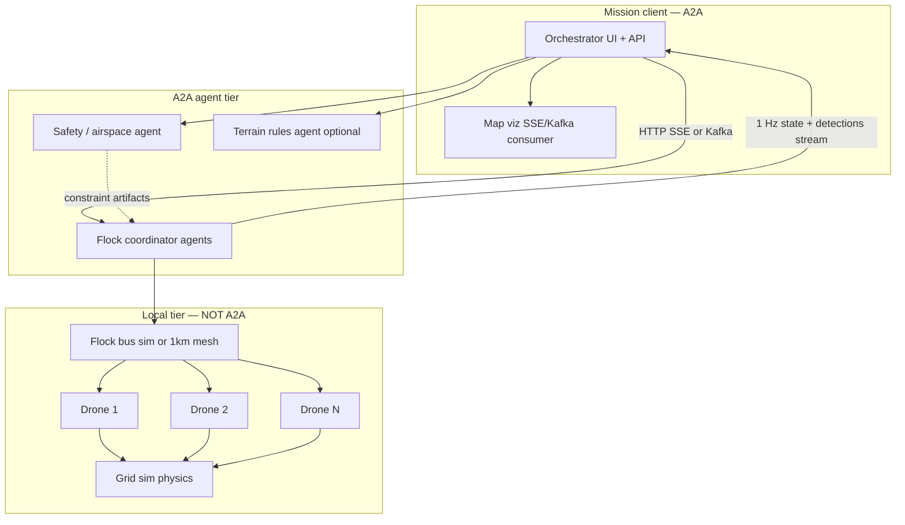
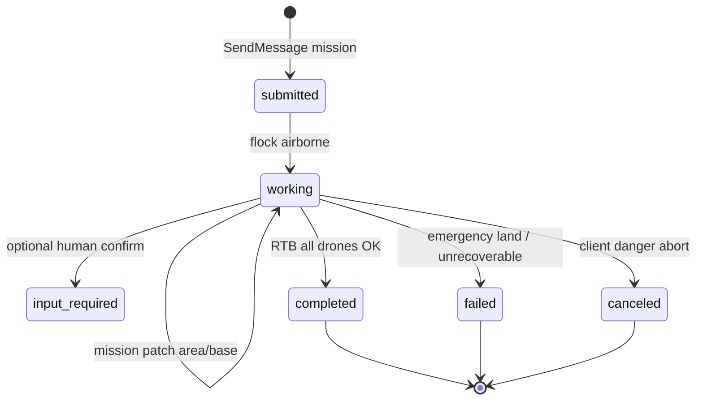
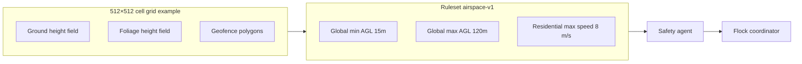
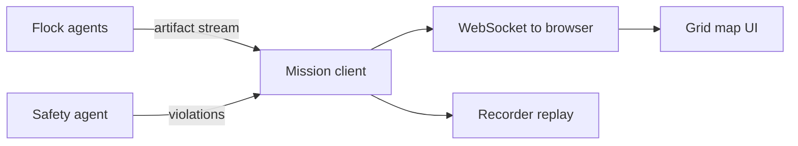
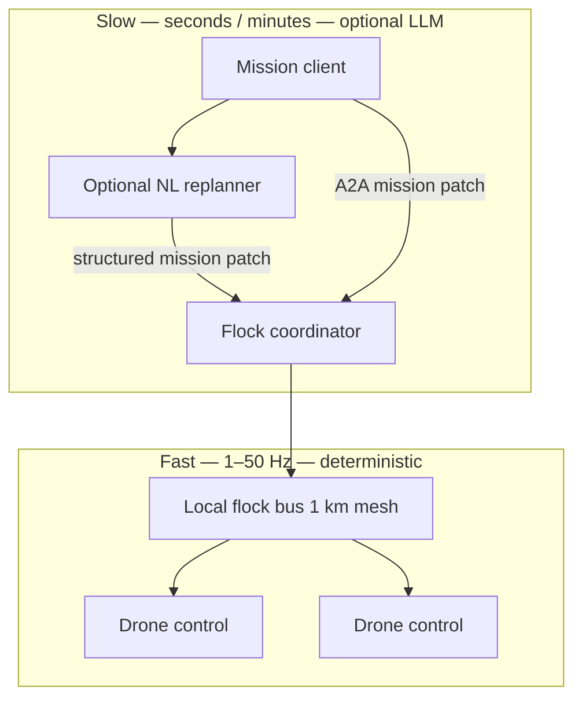
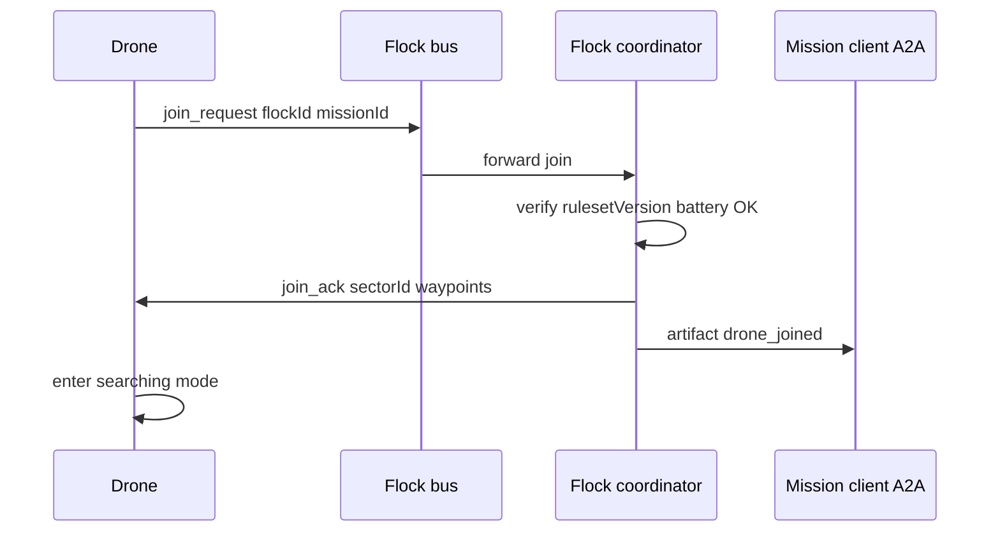
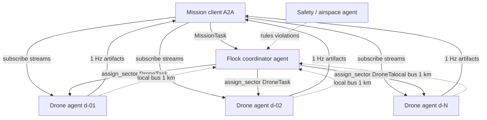

# Drone flocking — search & rescue (A2A design sketch)

> Copied here so this demo tree includes the design notes. Links to `benchmark/` and `bridge/` still point at the parent scaling-agents repo.

**Status:** design sketch + **Phase 1 & 2 implemented**  
**Phase 2 doc:** [DRONE-SAR-PHASE2-A2A.md](DRONE-SAR-PHASE2-A2A.md) — architecture, streaming, viz, runbook
**Domain:** Multi-drone search-and-rescue with flocks, moving base, geofencing, and streaming detections.  
**Protocol:** A2A for **mission orchestration and observability**; local/sim layer for **real-time flock physics**.

**Related:** [demo README](../README.md) · [A2A open questions](../../../docs/A2A-OPEN-QUESTIONS.md) · [LLM-AGENT-QUEUE.md](../../../benchmark/docs/LLM-AGENT-QUEUE.md) · [FANOUT-STREAM-BENCHMARK.md](../../../benchmark/docs/FANOUT-STREAM-BENCHMARK.md) · [BENCHMARKING-A2A-OBSERVATIONS.md](../../../benchmark/docs/BENCHMARKING-A2A-OBSERVATIONS.md)

---

## DevRel summary

**One-liner:** Mission control runs a multi-drone search-and-rescue operation where A2A handles **long-running mission orchestration and live telemetry** — not the real-time flight loop.

### The story

A mission client assigns search areas to **flocks of drones** looking for missing people/vehicles over a geofenced grid. The base can move mid-mission. Drones stream ~1 Hz state (position, battery, mode) and detections back to a live map. The client can patch the mission (new area, abort, target found), inject comms outages, and watch emergencies (RTB, emergency land).

### Why it’s a good A2A demo

It exercises patterns already benchmarked in this repo:

| A2A pattern | In the SAR story |
|-------------|------------------|
| Long-running **Tasks** | Whole search mission until RTB/abort/found |
| **Streaming artifacts** | ~1 Hz drone state + detections to the map |
| **Mission patches** | Base moved, area changed, danger abort |
| **Multiple agent types** | Flock coordinator, safety/airspace, optional terrain |
| **Fan-out observers** | Mission UI + audit/replay (v2 incident-triage benchmark) |
| **Kafka at scale** | N flocks / N drone agents on a shared request queue (v3.1 agent pool) |

### Agent topology (recommended)

```text
Mission client  →  Flock coordinator  →  N drone agents
                 ↘  Safety/airspace agent
```

| Agent | Role |
|-------|------|
| **Mission client** | Starts tasks, sends patches, subscribes to streams, drives viz |
| **Flock coordinator** | Search pattern, sector assignment, membership (join/leave) |
| **Drone agents** (Phase 2b) | One A2A server per drone; skill `sar:drone-worker` |
| **Safety agent** | Geofence / AGL rules; violation artifacts, not motor control |

Flocking is **deterministic coordination** (planner + local flock bus), not an LLM at flight rates. An LLM is optional only at the mission layer (e.g. natural-language patch → structured JSON). See [§15](#15-flocking-algorithms-and-joinleave) and [§16](#16-one-a2a-agent-per-drone).

### The key lesson for A2A talks

**A2A orchestrates; the flock stack executes.**

| Put on A2A | Keep local (not A2A) |
|------------|----------------------|
| Mission commands & patches | Collision avoidance (10–50 Hz) |
| 1 Hz state & detection JSON | Drone–drone mesh (~1 km) |
| References to photos (`photoRef`) | Raw video / multi-MB frames |
| Status: RTB, found, emergency land | Sub-second freeze/hold commands |

A2A is the **control plane and observability layer** for a fleet of autonomous workers — not the wire protocol for every sensor tick.

### Talk angle

> From incident triage copilot to drone SAR — same A2A primitives (Tasks, streaming, fan-out), harder scale and a clearer split between orchestration and real-time control.

**Hybrid demo:** HTTP for the operator edge (map, SSE, push); Kafka as the **complementary** work queue and event backbone for fleet Tasks and fan-out — not a transport replacement. See [§17](#17-hybrid-a2a--kafka-complementary-backend).

**AI / LLM:** Flocking and flight stay **deterministic** in MVP; optional LLM at the **mission copilot** layer only (NL → patch JSON, AAR). See [§18](#18-ai-and-llm-roles).

**Benchmark cross-links:** [FANOUT-STREAM-BENCHMARK.md](../../../benchmark/docs/FANOUT-STREAM-BENCHMARK.md) (v2) · [LLM-AGENT-QUEUE.md](../../../benchmark/docs/LLM-AGENT-QUEUE.md) (v3/v3.1) · [benchmark README](../../../benchmark/README.md) · [Hybrid pattern](../../../benchmark/docs/ARCHITECTURE-DIAGRAMS.md#7-hybrid-production-pattern-recommended)

---

## 1. Use case narrative

**Search and rescue** with **N drones** organised into **one or more flocks**, each flock assigned a search goal.

| Element | Description |
|---------|-------------|
| **Client (mission control)** | Spins up drones/flocks, assigns initial search goals and areas, sends mid-mission updates (moved base, new target area, abort, target found, danger) |
| **Moving base** | Truck or staging point; drones must **return before battery depletion** |
| **Targets** | 1–N missing “things” (person, vehicle, animal); types may differ; last-known location or **area**; positions may **change during search** |
| **Search** | Autonomous flock plans pattern: grid, spiral in/out, sector assignment, etc. |
| **Sensing** | ~**1 Hz** “photos” + optional IR; on-board or server-side **detection** of target type (may be moving) |
| **Terrain** | Artificial **grid**: ground height, foliage height, **geofenced** no-fly zones (tall buildings, aerials) |
| **Safety** | Min/max height AGL above terrain/objects, collision avoidance, geofence, optional max speed by zone; emergency land + recovery report |
| **Comms** | Client reachable (with injected outages); drone–drone mesh **~1 km** for flock coordination; beyond range → **autonomous** flock rules |

**Story in one line:** Mission control delegates long-running search **Tasks** to flock coordinators; drones stream **state and detections**; safety/policy agents publish **constraints**; the client **visualises** the grid world in real time.

---

## 2. What fits A2A vs what does not

### Strong A2A fit (mission layer)

| Requirement | A2A mapping |
|-------------|-------------|
| Spin up N drones / flocks with goals | `SendMessage` → `Task`; Agent Card discovery |
| Mid-mission updates (base, area, abort, found) | Follow-up messages, status updates, mission patch artifacts |
| Streaming progress (~1 Hz) | `TaskArtifactUpdateEvent` (partial append) + `TaskStatusUpdateEvent` |
| Drone state (position, battery, mode) | Structured JSON artifacts |
| Detections | Artifact with confidence + **photoRef** (not raw image bytes) |
| Emergency land + recovery | Terminal status `FAILED` or custom + position artifact |
| Multiple observers (UI, audit, replay) | Primary SSE/Kafka consumer + fan-out groups (see v2 benchmark) |
| Heterogeneous agents (coordinator vs policy) | Different Agent Cards / skills |

### Poor A2A fit (keep local / sim / RTOS)

| Requirement | Better layer |
|-------------|--------------|
| Collision avoidance at 10–50 Hz | On-drone or flock-local controller |
| Hard geofence / AGL enforcement | Onboard + simulator physics; policy agent **advises**, does not replace motors |
| Drone–drone mesh within 1 km | MQTT, DDS, UDP, or **in-sim bus** — not A2A transport |
| Multi-MB photos every second on the wire | Object store + **reference** in A2A artifact |
| Sub-second “freeze drone” for collision | Flock-local command; A2A records outcome |

**Rule:** **A2A orchestrates; flock stack executes.**

---

## 3. Architecture



### Recommended transport (from benchmark learnings)

| Path | Suggestion |
|------|------------|
| Client ↔ agents | **HTTP bridge** for UI + **Kafka** (`a2a.requests` / reply topics) for many long tasks |
| 1 Hz × N drones | Per-flock or per-drone reply topic; client merges streams |
| Critical alerts (found, danger, emergency land) | A2A **push** webhook or priority status |
| Flock internal | **Out of band** — coordinator ↔ drone sim only |

Full hybrid rationale: [§17](#17-hybrid-a2a--kafka-complementary-backend).

---

## 4. Agent roles

| Agent | Count | A2A server? | Responsibility |
|-------|------:|-------------|----------------|
| **Mission client** | 1 | Client only | Create tasks, patches, RTB/danger; subscribe all streams; **viz** |
| **Flock coordinator** | 1 per flock | Yes | Area decomposition, pattern (grid/spiral), waypoint assignment, aggregate detections |
| **Drone worker** | 0–N A2A agents | Optional | Either **inside coordinator** (sim) or **one agent per drone** for max visibility |
| **Safety / airspace** | 1+ | Yes | Geofences, min/max AGL, max speed zones; violation artifacts; freeze recommendations |
| **Terrain / world** | 0–1 | Optional | Publishes grid metadata, no-fly polygons (readonly artifacts) |

**Recommendation for MVP:** **1 A2A agent per flock** + internal drone state machine; add per-drone A2A only if you need per-drone Agent Cards in demos.

### Agent Card skills (sketch)

| Skill id | Agent | Description |
|----------|-------|-------------|
| `sar:flock-coordinator` | Flock | Accept mission, run search pattern, stream state |
| `sar:airspace-policy` | Safety | Evaluate positions against ruleset; emit violations |
| `sar:terrain-static` | Terrain | Serve grid dimensions, height fields, fence polygons |

---

## 5. Task and message model

### Task types

| Task | Parties | Lifetime |
|------|---------|----------|
| `MissionTask` | Client ↔ flock coordinator | Entire search until RTB complete / abort / found |
| `PolicyWatchTask` (optional) | Client ↔ safety agent | Overlaps mission; streams violations |
| `DroneTask` (optional) | Client ↔ drone agent | Fine-grained per-drone visibility |

### Status lifecycle (flock mission)



### Initial mission message (client → flock coordinator)

```text
mission:search-rescue
{
  "missionId": "sar-2026-001",
  "rulesetId": "airspace-v1",
  "base": {
    "cellX": 10, "cellY": 10, "altM": 0,
    "mobile": true
  },
  "targets": [
    {
      "id": "t1",
      "type": "person",
      "priority": 1,
      "searchArea": { "polygon": [[0,0],[500,0],[500,500],[0,500]] },
      "lastKnownCell": { "x": 120, "y": 340 }
    }
  ],
  "searchPattern": "grid-out-in",
  "drones": [
    { "id": "d-01", "sensors": ["rgb", "ir"] },
    { "id": "d-02", "sensors": ["rgb"] }
  ],
  "sim": {
    "tickHz": 1,
    "gridCells": 512,
    "cellSizeM": 2
  }
}
```

### Streaming artifact — drone state / detection (~1 Hz)

```json
{
  "droneId": "d-01",
  "tick": 1842,
  "position": { "x": 120.5, "y": 340.2, "altAglM": 25 },
  "headingDeg": 90,
  "batteryPct": 62,
  "mode": "search",
  "detection": {
    "targetType": "person",
    "confidence": 0.91,
    "bboxNorm": [0.2, 0.3, 0.1, 0.2]
  },
  "photoRef": "file://sim-frames/sar-001/d-01/t1842.jpg"
}
```

Use **`append: true`** partial artifacts for timeline; terminal **`COMPLETED`** when flock RTB done.

### Mid-mission patch (client → coordinator)

```json
{
  "missionPatchVersion": 3,
  "baseMoved": { "cellX": 15, "cellY": 10 },
  "targetUpdates": [
    { "id": "t1", "searchArea": { "polygon": "..." } }
  ],
  "command": "continue"
}
```

Commands: `continue` | `return` | `hold` | `danger_abort` | `target_found`.

### Emergency land (drone → client via coordinator)

```json
{
  "droneId": "d-02",
  "event": "emergency_land",
  "position": { "x": 88, "y": 201, "altAglM": 0 },
  "batteryPct": 4,
  "errorCode": "MOTOR_DEGRADED",
  "recoveryHint": "manual_pickup"
}
```

---

## 6. Simulation world (grid)

| Layer | Data | Used by |
|-------|------|---------|
| **Ground height** | `heightM[cell]` | AGL calculation |
| **Foliage height** | `foliageM[cell]` | Min clearance above “objects” |
| **Geofence** | Polygons + `no-fly` | Safety agent + local hard stop |
| **Zones** | Residential / rural rules | Min AGL, max speed |



**Search patterns (flock-local, not A2A):**

- Grid lane assignment per drone  
- Spiral out-from-last-known  
- Spiral in-to-last-known  
- Sector fan from flock centroid  

---

## 7. Safety and policy agent

| Check | Local enforce | A2A surface |
|-------|---------------|-------------|
| Geofence entry | Hard block in sim | Violation artifact + optional client alert |
| Below min AGL (non-landing) | Hard block | Violation artifact |
| Landing below min AGL | Allowed if `mode=land` | Status transition |
| Drone–drone separation | Local repulsion | Near-miss artifact; **freeze** recommendation to coordinator |
| Max speed in zone | Throttle in sim | Informational unless violation sustained |
| Battery RTB | Local planner | `mode=rtb` in state stream; `FAILED` if landed early |

Policy agent publishes **`ruleset` artifact** at mission start; flock coordinator **subscribes** (in sim: read shared rules; in prod: poll A2A or cache).

---

## 8. Communications model

| Link | Range / availability | Protocol |
|------|----------------------|----------|
| Client ↔ agents | Assumed always on (**inject outages** in tests) | A2A (HTTP/Kafka) |
| Coordinator ↔ drones | In sim: in-process; story: **1 km mesh** | Custom flock bus |
| Drone ↔ drone | Same flock, mesh | Not A2A — gossip/separation hints |

**Autonomy rule:** If client link lost > T seconds, flock continues search under last patch; RTB when battery policy says so; reconcile on reconnect with `missionPatchVersion`.

**Failure injection (test matrix):**

- Client outage windows  
- Single drone motor fault  
- Safety agent disagree (policy version bump)  
- Target area jumps mid-search  
- Base moves during RTB  

---

## 9. Visualization

Treat the map UI as a **first-class A2A consumer** (like v2 primary + audit fan-out).

| View | Source |
|------|--------|
| 2D/3D grid map | Terrain agent + drone position artifacts |
| Flock sectors / coverage heatmap | Coordinator artifacts |
| Geofences / zones | Policy agent artifacts |
| Drone icons (battery, mode) | State stream |
| Detections | Markers + thumbnail from `photoRef` |
| Event log | Status updates + push notifications |
| Replay | Recorded artifact log (Kafka or JSONL) |

**Stack sketch:**

- **Frontend:** Leaflet / Mapbox / Cesium for geo; or canvas for **cell grid**  
- **Live:** Mission client subscribes SSE or Kafka per flock task  
- **Backend:** Quarkus bridge or Kafka binding from this repo’s patterns  



---

## 10. Phased build plan

### Phase 0 — Design (this document)

- Agent roles, JSON contracts, sim grid API, viz wireframe  
- No A2A code yet  

### Phase 1 — Grid sim + flock logic (no A2A)

| Deliverable | Notes |
|-------------|-------|
| `sim/` | Grid, heights, geofence, battery, 1 Hz tick |
| Flock coordinator **library** | Patterns, separation, RTB |
| CLI mission runner | JSON mission file → stdout state |
| **Success:** N drones search area; RTB before battery; geofence respected |

### Phase 2 — A2A flock coordinator + client + narrator ✅ implemented

| Deliverable | Notes |
|-------------|-------|
| `a2a/` | Quarkus agents + mission client + `sar-core` — **not** in `bridge/` |
| Skill `sar:flock-coordinator` | JSON-RPC on `:8083`; `capabilities.streaming: true` |
| Skill `sar:mission-narrator` | JSON-RPC on `:8084`; Ollama briefings; artifact `sar-narrative` |
| Mission client | `SendMessage`, SSE subscribe; async narrator Tasks on significant events |
| Stream telemetry artifacts | Same JSON as §5 — artifact ids `sar-telemetry` (append), `sar-mission-summary` |
| Viz | Post-mission via `SarVizExporter` → same outputs as Phase 1 `--viz-out` |
| **Success:** Client starts mission via A2A; receives streamed telemetry; optional LLM briefings; writes replay/snapshot |

**Architecture diagrams:** [`drone-sar-phase2-a2a-narrator.mmd`](diagrams/drone-sar-phase2-a2a-narrator.mmd) · [`drone-sar-phase2-narrator-sequence.mmd`](diagrams/drone-sar-phase2-narrator-sequence.mmd)

**Full detail:** [DRONE-SAR-PHASE2-A2A.md](DRONE-SAR-PHASE2-A2A.md) (streaming event flow, Agent Cards, env vars, gaps).

### Phase 3 — Safety agent + patches

| Deliverable | Notes |
|-------------|-------|
| Safety agent | Ruleset + violation stream |
| Mid-mission patch messages | Base move, area change, abort |
| Failure injection harness | Scripted outages |

### Phase 4 — Kafka scale + fan-out (hybrid demo)

| Deliverable | Notes |
|-------------|-------|
| **Hybrid** HTTP bridge + Kafka backend | Operator UI on HTTP/SSE; fleet on `a2a.requests` + reply topics — [§17](#17-hybrid-a2a--kafka-complementary-backend) |
| Multiple flocks on `a2a.requests` | Reuse v3.1 agent pool patterns |
| Per-flock or per-drone reply topics | ~1 Hz × N artifact streams |
| Audit consumer on reply topic | Replay for post-mission review (v2 fan-out pattern) |
| **Success:** Same A2A contracts as Phase 2; Kafka proves scale + multi-subscriber without rewriting agents |

---

## 11. Module layout (proposed)

```text
drone-sar/
  README.md                 — run instructions
  design/                   — link or copy of this doc
  sim/                      — grid world, drone physics, flock algorithms (Phase 1)
  a2a/                      — Phase 2 A2A agent + client (see DRONE-SAR-PHASE2-A2A.md)
    sar-core/
    flock-coordinator/
    mission-client/
  agents/                   — Phase 3+ (airspace-policy, drone-worker)
  client/                   — optional future mission-control UI
  missions/
    sample-mission.json
  viz/
    web/                    — replay.html
    out/                    — generated replay/snapshot dirs
```

---

## 12. Mapping to benchmark workloads

| Benchmark | Drone SAR analogue |
|-----------|-------------------|
| v1 thin stream | **Not representative** — ignore for SAR |
| v2 incident triage fan-out | Client + audit watching many stream events |
| v3 persistent llm-sim | Long mission, 1 Hz steady stream, warmup optional |
| v3.1 agent pool | Many flock agents on Kafka queue |
| Hybrid HTTP + Kafka | UI on HTTP/SSE; fleet on Kafka |

---

## 13. Open decisions

| # | Question | Options |
|---|----------|---------|
| 1 | One agent per drone vs per flock? | MVP sim: **per flock**; production story: **hierarchical per-drone** (§16) |
| 2 | Detection on drone vs central? | MVP: **central stub** on coordinator |
| 3 | Real LLM in loop? | **No** for v1 — deterministic search; optional mission-layer LLM — [§18](#18-ai-and-llm-roles) |
| 4 | Kafka from day one? | Phase 2 HTTP; Phase 4 **hybrid** — [§17](#17-hybrid-a2a--kafka-complementary-backend) |
| 5 | 2D grid only? | MVP **2D**; 3D viz optional |

---

## 14. Decision log

| Date | Decision |
|------|----------|
| 2026-08-13 | Initial design sketch captured; scenario **C — Drone SAR** added to scenarios index |
| 2026-08-13 | §15 — flocking is deterministic (coordinator + local bus); LLM optional at mission layer only |
| 2026-08-13 | §16 — hierarchical **one A2A agent per drone** model documented |
| 2026-08-13 | DevRel summary + §17 hybrid HTTP/Kafka + §18 AI/LLM roles |
| 2026-08-14 | Phase 1 grid sim implemented — `sim/` + CLI; see [DESIGN-CHECK.md](../DESIGN-CHECK.md) |
| 2026-08-18 | Phase 2 A2A implemented — `a2a/`; [DRONE-SAR-PHASE2-A2A.md](DRONE-SAR-PHASE2-A2A.md) |
| 2026-08-18 | Streaming: JSON-RPC + SSE artifacts; viz post-mission from buffered telemetry |
| 2026-08-18 | Mission validation: target/base LKP must be outside no-fly zones |

---

## 15. Flocking algorithms and join/leave

Autonomous flocking in this scenario is **designed coordination** — not an emergent side-effect of drones acting fully independently, and **not** something a local LLM needs to solve at flight rates.

### 15.1 Independence vs flocking

| Model | Outcome |
|-------|---------|
| **Fully independent drones** (each optimizes alone) | Overlap, gaps, weak collision handling, poor join/leave |
| **Centralized flock coordinator** | Sector assignment, membership, replan on patch — **recommended MVP** |
| **Distributed flock bus** | Same rules + gossip within 1 km; coordinator optional for global alloc |
| **Boids-style local rules** | Looks “emergent” but still **explicit** separation/alignment/cohesion — better for cinema than SAR coverage |

For search-and-rescue, prefer **coverage partitioning** (grid lanes, spiral sectors, Voronoi cells) over pure boids.

### 15.2 Control stack (no LLM on the flock loop)



| Layer | Rate | Responsibility | LLM? |
|-------|------|----------------|------|
| Motor / separation | 10–50 Hz | Avoid collision, hold AGL | **No** |
| Waypoint / pattern | 1–5 Hz | Follow sector path, search pattern | **No** |
| Sector allocation | on join/leave/patch | Assign cells, rebalance coverage | **No** |
| Battery / RTB | 1 Hz | Integrate drain, trigger return to moving base | **No** |
| Mission patch | event | New area, base move, abort | **No** (structured JSON) |
| NL mission update | rare | Parse vague client text → polygon | **Optional** at client only |

### 15.3 Search patterns (coordinator-local)

| Pattern | Use when |
|---------|----------|
| **Grid lanes** | Rectangular area; N drones → N parallel sweeps |
| **Spiral out-from-LKPL** | Last-known point near centre |
| **Spiral in-to-LKPL** | Confirm centre, expand confidence outward |
| **Sector fan** | Radial slices from flock centroid |
| **Coverage heatmap** | Reassign drones to highest-uncertainty cells (greedy) |

Coordinator maintains **`searchedCells`** bitmask or heatmap; emits as optional artifact for viz.

### 15.4 Membership model

Coordinator holds authoritative **membership table**:

```json
{
  "flockId": "flock-alpha",
  "missionPatchVersion": 3,
  "members": [
    { "droneId": "d-01", "sectorId": "lane-2", "state": "searching" },
    { "droneId": "d-02", "sectorId": "lane-3", "state": "rtb" }
  ]
}
```

Published to client on change (~low rate artifact), not every tick.

### 15.5 Join protocol (drone → flock)



| Step | Action |
|------|--------|
| 1 | Drone in **1 km** range or launched from base with handoff token |
| 2 | `join_request` with `missionId`, `rulesetVersion`, `droneId` |
| 3 | Coordinator validates capacity, assigns **sector** / lane |
| 4 | Drone acks; coordinator redraws coverage if needed |
| 5 | A2A artifact to client: `drone_joined` |

**No LLM** — table lookup + sector allocator (greedy column/row assignment is enough for MVP).

### 15.6 Leave protocol (drone ← flock)

| Trigger | Coordinator action | Drone action | A2A event |
|---------|-------------------|--------------|-----------|
| **Battery RTB threshold** | Remove from search; optionally assign relay slot | Solo path to moving base | `mode=rtb` in stream |
| **Reassign to other flock** | `leave` + handoff token for flock B | Join other flock (§15.5) | `drone_transferred` |
| **Motor / sensor fault** | Remove; shrink sectors | Emergency land (§5) | `emergency_land` |
| **Mission patch** (area shrink) | Surplus drones → RTB or merge | RTB or join | `flock_resized` |
| **Target found** (local sector) | Redistribute or RTB surplus | Per client command | `target_found` |
| **Client danger abort** | All leave → RTB | RTB | `mission_canceled` |

After leave, coordinator **reallocates sectors** to remaining members (same algorithm as join).

### 15.7 Split and merge flocks (multiple targets)

| Operation | Who decides | Mechanism |
|-----------|-------------|-----------|
| **Split** | Mission client | New flock `Task` + drone id list; old flock coordinator drops members |
| **Merge** | Mission client | Single polygon + one coordinator; redundant coordinator stands down |
| **Auto split** | Optional rule | Two targets farther than X km → client suggests two flocks (deterministic) |

Multiple flocks = **multiple A2A Tasks** (one coordinator agent each), not one LLM reasoning about “teams.”

### 15.8 Local flock bus (1 km mesh) — not A2A

Messages on the bus (UDP/MQTT/sim queue), **sub-second**, never on A2A:

| Message | Purpose |
|---------|---------|
| `separation_hint` | Neighbour position for deconfliction |
| `waypoint_sync` | Leader waypoint + offset |
| `join_request` / `join_ack` | Membership |
| `sector_update` | New lane assignment |
| `freeze` | Short hold after near-miss (safety agent or coordinator) |

Beyond 1 km: drone follows last **autonomous** rules (continue sector, RTB on battery, hold if lost).

### 15.9 Where an LLM fits (optional, mission layer only)

| Fit | LLM? | Alternative |
|-----|------|-------------|
| Separation, geofence, patterns | **No** | Geometry + rules |
| Join/leave state machine | **No** | Coordinator table |
| **Structured** mission patch | **No** | JSON schema |
| **Natural language** patch (“search the gully north of base”) | **Optional** | Client-side LLM → polygon JSON → A2A |
| Detection “person vs deer” | **Optional** | Small CV model on coordinator |
| Operator briefing / after-action summary | **Yes** | UI only; no flight impact |

**Local LLM per drone:** not recommended (power, latency, no gain for flocking).

**Coordinator LLM:** only if you want occasional **replan** (e.g. every 60 s when client sends prose updates) — output must be **validated structured patch**, never direct motor commands.

### 15.10 MVP recommendation

1. **One deterministic flock coordinator** per flock (Java, no LLM).  
2. **Greedy sector assignment** on join/leave/patch.  
3. **Local bus in sim**; mesh stubbed as in-process events.  
4. **Optional client LLM** later for NL → `missionPatch` JSON only.  
5. Surface join/leave/RTB on **A2A artifacts** for viz and audit — same streaming model as v2/v3 benchmarks.

---

## 16. One A2A agent per drone

When each physical (or sim) drone runs its **own A2A server**, the system becomes a **multi-agent** deployment: one mission client, one flock coordinator agent, **N drone worker agents**, plus optional policy/terrain agents.

### 16.1 Deployment models

| Model | A2A shape | Who plans the flock? |
|-------|-----------|----------------------|
| **Flat** | Client → **N drone agents** directly | Client or separate planner assigns sectors |
| **Hierarchical** (recommended) | Client → **coordinator** → **N drone agents** | Coordinator delegates; each drone is a first-class server |



**Recommendation:** **Hierarchical** — client stays strategic; coordinator owns membership and coverage; drones are visible, addressable agents (strong A2A demo narrative).

### 16.2 Drone agent responsibilities

#### A2A-facing (on the wire)

| Responsibility | A2A mechanism |
|----------------|---------------|
| Expose **Agent Card** | Skill `sar:drone-worker`; sensors, streaming, push |
| Accept work | `SendMessage` from coordinator → **`DroneTask`** in `working` |
| Telemetry ~1 Hz | Partial **`TaskArtifactUpdateEvent`** (position, battery, mode, sector) |
| Detections | Same stream; `photoRef` + detection JSON — not raw JPEG |
| Lifecycle | `WORKING` → `COMPLETED` (RTB at base) / `FAILED` (emergency land) |
| Join / leave flock | Apply `assign_sector` / `leave`; emit membership artifacts |
| Mission version | Reject stale commands if `missionPatchVersion` mismatch |
| Emergency | Terminal status + position/error artifact; optional **push** to client |
| Low-confidence find (optional) | `input-required` → client confirms before `target_found` |

Each drone agent is a **small A2A server** (Quarkus bridge or Kafka agent JVM) — same pattern as `BenchmarkAgentHandler` / `BenchmarkKafkaAgent`, different skill handler.

#### Local-only (inside drone process — not A2A)

| Responsibility | Notes |
|----------------|--------|
| Waypoint / sector following | Execute assigned lane or spiral |
| Separation / near-miss | Local repulsion; honour `freeze` from bus |
| AGL / geofence | Hard limits from terrain + cached ruleset |
| Battery model | Trigger RTB; do not stream motor telemetry at 50 Hz |
| Camera / detector stub | 1 Hz detection candidates |
| **Flock bus** | Join/leave, separation hints within ~1 km |

**Boundary:** A2A = mission-visible ~1 Hz; flock bus = coordination; control loop = inside agent (or sim tick).

### 16.3 Task ownership

| Task | Parties | Lifetime |
|------|---------|----------|
| **`MissionTask`** | Client ↔ flock coordinator | Entire SAR operation |
| **`DroneTask`** | Coordinator ↔ each drone agent | Join/assign → RTB / leave / fail |

**Flow:**

1. Client opens `MissionTask` on coordinator (area, targets, base, ruleset).  
2. Coordinator `SendMessage` to each drone → **`DroneTask`** with sector/lane params.  
3. Client **subscribes** to each active `DroneTask` (or to coordinator aggregate — see §16.7).  
4. Coordinator maintains coverage map; patches propagate as versioned sector updates.

### 16.4 Message shapes

**Coordinator → drone (`SendMessage`):**

```json
{
  "command": "assign_sector",
  "missionPatchVersion": 3,
  "flockId": "alpha",
  "sector": {
    "lane": 2,
    "waypoints": [[120, 340], [120, 400]]
  },
  "rulesetId": "airspace-v1"
}
```

**Drone → client / coordinator (streaming artifact, ~1 Hz):**

```json
{
  "droneId": "d-01",
  "mode": "search",
  "position": { "x": 120.5, "y": 340.2, "altAglM": 25 },
  "batteryPct": 62,
  "sectorId": "lane-2",
  "detection": null,
  "photoRef": "file://sim-frames/sar-001/d-01/t1842.jpg"
}
```

**Client mission patches:** send to **coordinator only**; coordinator fan-out version bump to drone agents (avoid N-way client → drone patches in hierarchical model).

### 16.5 Join / leave with per-drone agents

| Event | A2A | Local bus |
|-------|-----|-----------|
| **Join flock** | Coordinator creates **DroneTask** + `assign_sector` | `join_ack` |
| **RTB** | Drone streams `mode=rtb` → `COMPLETED` at base | `leave`; coordinator reallocates |
| **Reassign flock** | Cancel DroneTask on A; new task on B | Handoff token |
| **Failure** | `FAILED` + emergency artifact | Coordinator reallocates sector |
| **Patch / abort** | Coordinator cancels or updates all DroneTasks | Membership sync |

Each transition is a **Task state change** on that drone — good for audit, replay, and viz.

### 16.6 Interaction with other agents

| Agent | Role vs drone agents |
|-------|----------------------|
| **Mission client** | Discovers N Agent Cards; subscribes to streams; patches coordinator only |
| **Flock coordinator** | Creates / updates / cancels **DroneTasks**; membership table; coverage artifact |
| **Safety / airspace** | Ruleset artifact; violations → coordinator → `hold` on specific DroneTask |
| **Terrain** (optional) | Drones read grid locally in sim — not per-tick A2A |

Drone agents **do not** use A2A for separation — only the **flock bus** (§15.8).

### 16.7 Transport and client viz

| Scale | Pattern |
|-------|---------|
| Demo (few drones) | N Quarkus agents `:808x`; client SSE per drone |
| Many drones | Kafka: route by `droneId` / skill; reply topic `a2a.updates.drone-{id}` per [benchmark harness](../../../benchmark/README.md) |
| Light UI | Coordinator **aggregates** N streams into one mission artifact (M=1 client subscription) |

**Scaling note (v3.1):** N active drone agents ≈ N concurrent long tasks; Kafka request topic **partitions ≥ N**; agent pool or **one JVM per drone** (`A2A_BENCH_AGENT_COUNT`-style ops).

### 16.8 Coordinator vs drone — division of labour

| Concern | Coordinator | Drone agent |
|---------|-------------|-------------|
| Search pattern | **Yes** | Executes |
| Sector assignment | **Yes** | Executes |
| Coverage map | **Aggregates** | Reports cells searched |
| Separation | Advises freeze | **Executes** |
| Battery RTB | Fleet surplus logic | **Own** RTB path |
| Detection fusion (optional) | May fuse | **Produces** |
| A2A stream to client | Summary + membership | **Own** 1 Hz stream |
| LLM | Optional replan | **No** (MVP) |

### 16.9 Agent Card sketch

```json
{
  "name": "sar-drone-d-01",
  "description": "Search-and-rescue drone worker",
  "skills": [{
    "id": "sar:drone-worker",
    "name": "SAR drone sector search",
    "description": "Execute assigned sector; 1 Hz telemetry; RGB+IR"
  }],
  "capabilities": {
    "streaming": true,
    "pushNotifications": true
  }
}
```

Coordinator card uses skill `sar:flock-coordinator` (§4).

### 16.10 Tradeoffs vs one agent per flock

| Per-drone agent | Per-flock agent (§4 MVP) |
|-----------------|---------------------------|
| **Pros:** True multi-agent; per-drone Card/Task; failure isolation; Kafka scale story | **Pros:** Fewer JVMs; one stream; simpler Phase 1 sim |
| **Cons:** N servers; N subscriptions; heavier ops/viz | **Cons:** Drones invisible as A2A peers |

**Phasing:** Phase 1 sim — drones **inside** coordinator library; Phase **2b** — split into separate A2A servers per drone.

### 16.11 Module layout addition

```text
agents/
  flock-coordinator/
  airspace-policy/
  drone-worker/          # one deployable image; N instances with DRONE_ID
    SarDroneAgent.java
    DroneTaskHandler.java
```

---

## 17. Hybrid A2A + Kafka (complementary backend)

This scenario is intentionally a **hybrid demo**: the same A2A Task / artifact / status model on both paths; **HTTP** where the human sits, **Kafka** where the fleet scales and multiple systems need the same mission stream.

Kafka is **complementary**, not “A2A on Kafka instead of HTTP.”

### 17.1 Two transport jobs

```text
Mission UI / SDK                    Fleet of long-running agents
       │                                      │
       ▼                                      ▼
HTTP bridge (Quarkus)                  Kafka (a2a.requests + reply topics)
 · Agent Card discovery                 · N flock / drone Tasks queued
 · SSE to browser map                   · ~1 Hz × N artifact streams
 · Push for found / danger              · Agent pool scales with partitions
 · Low ttfc for operator                · Fan-out: UI + audit + replay
```

From [LLM-AGENT-QUEUE.md](../../../benchmark/docs/LLM-AGENT-QUEUE.md) and [architecture diagram §7](../../../benchmark/docs/ARCHITECTURE-DIAGRAMS.md#7-hybrid-production-pattern-recommended):

```text
Clients (HTTP/SSE, webhooks)
        │
        ▼
   Quarkus bridge          ← auth, agent card, SDK
        │
        ▼
   a2a.requests            ← partitioned work queue
        │
        ▼
   Agent pool              ← flock + drone workers; scale with partitions
        │
        ▼
   reply topic(s)          ← per-flock, per-drone, or per-client
        │
        ├── primary consumer (mission map UI)
        └── fan-out (audit, replay, automation)
```

### 17.2 Why SAR maps to hybrid (benchmark signals)

| SAR workload signal | Why Kafka helps | Benchmark analogue |
|---------------------|-----------------|-------------------|
| Missions run **minutes** | Async Tasks; bridge does not hold threads | v3 persistent llm-sim |
| **N × ~1 Hz** partial artifacts | Ordered stream log; dedicated reply topics | v3 steady stream |
| **M > 1 observer** (map + audit + replay) | Independent consumer groups | v2 incident triage fan-out |
| **Burst** — spin up flocks, mid-mission patches | Queue depth + lag = visible backpressure | v3.1 scaling sweeps |
| **Agent pool scaling** | Partitions ≥ concurrent Tasks; agents ≥ concurrency | v3.1 agent pool |

**HTTP still wins** for operator edge latency (time-to-first-chunk at higher concurrency in v2) — keep the bridge for discovery, SSE map, and push alerts.

### 17.3 What makes it a useful DevRel demo

| Property | Why it matters |
|----------|----------------|
| **Credible story** | Mission control + fleet telemetry is obviously long-running and multi-subscriber |
| **Clear boundary** | A2A/Kafka for orchestration + observability; local flock bus for real-time coordination |
| **Shows both strengths** | HTTP for UX; Kafka for fleet scale, fan-out, post-mission replay |
| **Builds on proven workloads** | v2 fan-out + v3 long Tasks + v3.1 pool — repackaged as SAR, not synthetic `bench:*` |

**Punchline:** *Same A2A primitives everywhere; HTTP where the human sits, Kafka where the fleet scales and multiple systems need the same mission stream.*

### 17.4 Phasing

| Phase | Transport |
|-------|-----------|
| **2** | HTTP-only — few drones, one flock; proves A2A Tasks + streaming + viz |
| **4** | Add Kafka — multi-flock / per-drone agents; hybrid without changing A2A contracts |

---

## 18. AI and LLM roles

**Short answer:** flocking, flight, and safety stay **deterministic** in the MVP. AI/LLMs are **optional at slow, human-facing layers** — mission interpretation, detection, post-mission narrative — not the real-time control loop.

**One-liner for talks:** *LLMs are the mission copilot, not the pilot.*

### 18.1 What does not need an LLM

| Layer | Mechanism | Why not LLM |
|-------|-----------|-------------|
| Flocking / sectors | Coordinator planner (grid, spiral, greedy alloc) | Coverage is optimization |
| Collision / separation | Repulsion, freeze, geofence | Latency and safety |
| Battery / RTB | Constraint integration | Deterministic math |
| Safety / airspace | Rules engine | Hard limits |
| Per-drone flight loop | Waypoint follow (10–50 Hz) | No model call at motor rates |

See [§15](#15-flocking-algorithms-and-joinleave) — join/leave, sector assignment, and replan on patch are **state machines + allocators**, not reasoning loops.

### 18.2 Where AI fits (not always LLM)

| Use | AI type | Layer | Notes |
|-----|---------|-------|-------|
| **Target detection** | Small **CV model** (or sim stub) | Drone or coordinator | 1 Hz frames → JSON + `photoRef`; not raw video on A2A |
| **Detection fusion** | CV + rules | Coordinator | Merge N sightings; threshold → `input-required` for human confirm |
| **Near-miss / anomaly** | Rules or lightweight ML | Safety agent | Geofence violations are rules-first |

MVP Phases 1–2: **deterministic stub** detections. Real CV is a natural Phase 3+ upgrade without changing A2A shape.

### 18.3 Where LLMs optionally fit (mission layer, slow)

Seconds-to-minutes, human-in-the-loop; output always **validated structured JSON** before agents execute:

| Use | Who | A2A surface |
|-----|-----|-------------|
| **Natural-language mission updates** | Mission client (+ optional LLM) | “Search the gully north of base” → `missionPatch` JSON → coordinator |
| **Multi-target prioritization** | Client or planner | Priority fields in patch (rules work too) |
| **Occasional replan** | Coordinator (rare) | Messy intel → structured patch only — **never** motor commands |
| **Operator briefing / AAR** | UI only | Summary from artifact log; no flight impact |
| **Low-confidence “found?”** | Client | LLM narrates evidence; human decides via `input-required` |

```text
Human prose  →  LLM (optional)  →  JSON schema validation  →  A2A SendMessage / patch
                                                      ↓
                              Deterministic coordinator + drones execute
```

| Placement | Recommendation |
|-----------|----------------|
| **Local LLM per drone** | Not recommended — power, latency, no flocking benefit |
| **Coordinator LLM** | Only occasional replan; validated patch output |
| **Client LLM** | Best default for NL → patch |

### 18.4 Relation to benchmark “LLM-sim” workload

v3 **`bench:llm-sim`** is a **shape analog** — long Task, think phase, then steady partial stream — not a requirement that SAR embed an LLM.

| LLM-sim pattern | SAR equivalent |
|-----------------|----------------|
| Long-running Task | Whole search mission |
| Think phase | Mission setup / sector alloc (deterministic in MVP) |
| Token stream | ~1 Hz drone telemetry + detections |
| Fan-out consumers | Map UI + audit + replay |

Replace “LLM tokens” with “drone artifacts” and the same [hybrid architecture](#17-hybrid-a2a--kafka-complementary-backend) applies.

### 18.5 Phasing

| Phase | AI / LLM role |
|-------|---------------|
| **1 — Grid sim** | None; deterministic search + stub detections |
| **2 — A2A demo** | None; proves Tasks + streaming + viz |
| **3 — Safety + patches** | Optional **client LLM** for NL → patch JSON |
| **Later** | CV on `photoRef`; operator AAR LLM; optional slow replan agent |

---

## References

- [A2A task / artifact / status model](https://github.com/a2aproject/A2A)
- [Benchmark fan-out design](../../../benchmark/docs/FANOUT-STREAM-BENCHMARK.md)
- [When Kafka fits agents / hybrid pattern](../../../benchmark/docs/LLM-AGENT-QUEUE.md)
- [Hybrid production diagram §7](../../../benchmark/docs/ARCHITECTURE-DIAGRAMS.md#7-hybrid-production-pattern-recommended)
