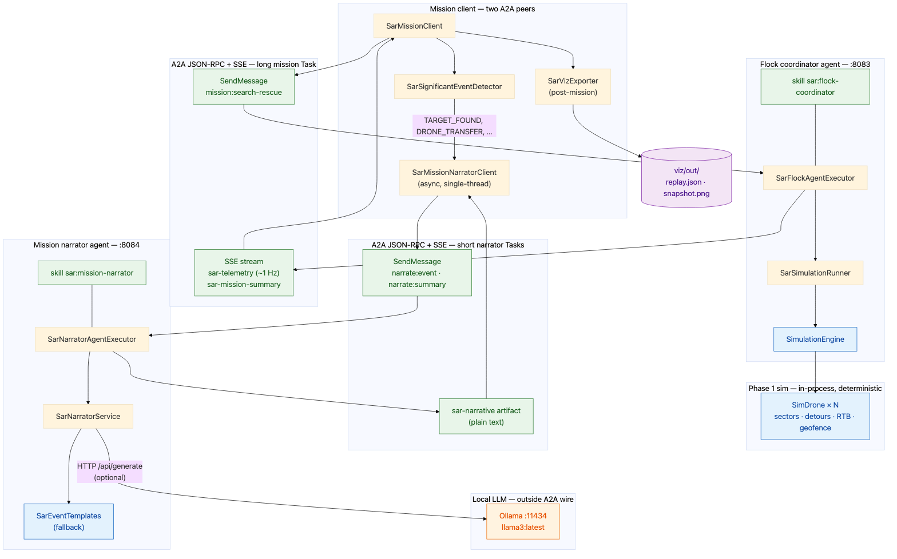
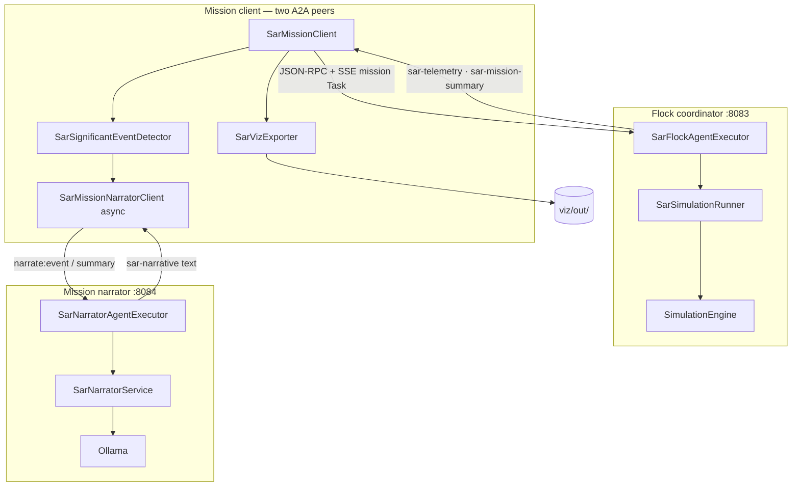
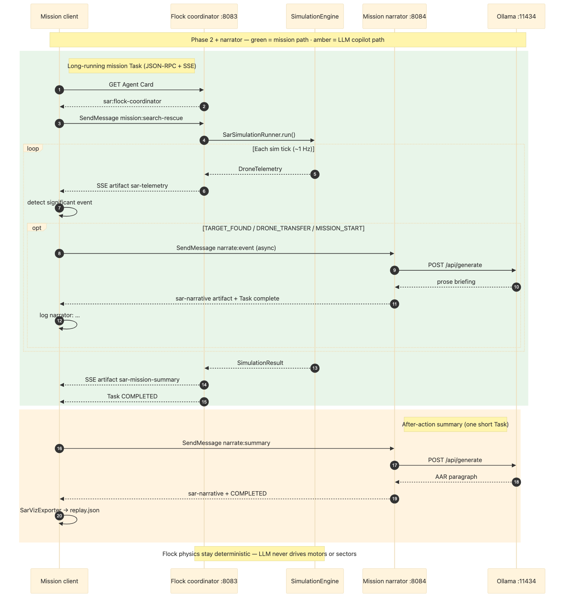

# Drone SAR — Phase 2 A2A implementation

> Copied here so this demo tree includes the design notes. Links to `benchmark/` and `bridge/` still point at the parent scaling-agents repo.

**Status:** implemented  
**Code:** [`a2a/`](../a2a/)  
**Parent design:** [DRONE-SAR-A2A-DESIGN.md](DRONE-SAR-A2A-DESIGN.md) §10 Phase 2  
**Phase 1 sim:** [`sim/`](../sim/)

Phase 2 wraps the Phase 1 grid simulation in the **official A2A JSON-RPC protocol** (`a2a-java` SDK). The sim still executes flock physics in-process; A2A is the **control plane and observability layer**.

---

## 1. Goal

| In scope | Out of scope (later phases) |
|----------|----------------------------|
| Long-running A2A **Task** for a SAR mission | Safety / airspace agent (Phase 3) |
| **Streaming** drone telemetry as task artifacts | Mid-mission patch messages |
| Mission client via `SendMessage` + SSE | Kafka hybrid backend (Phase 4) |
| Post-mission **viz** (replay.json, snapshot.png) | One A2A agent per drone (Phase 2b) |
| **Mission narrator** agent + Ollama briefings (design §18) | Live browser map fed directly from SSE |
| Official JSON-RPC on two agents + client | Push webhooks (Phase 3+) |

---

## 2. Module layout

```text
a2a/
  README.md                 Run instructions
  DESIGN.md                 Short design summary (links here)
  sar-core/                 Shared mission parsing + sim runner + viz + narrator types
  flock-coordinator/        Quarkus A2A agent (:8083)
  mission-narrator/         Quarkus A2A agent (:8084) + Ollama
  mission-client/           A2A SDK client (JSON-RPC + SSE)
  scripts/run-phase2-demo.sh
  scripts/run-phase2-narrator-demo.sh
```

| Module | Artifact | Role |
|--------|----------|------|
| `sar-core` | `drone-sar-a2a-core` | `SarMissionRequest`, `SarSimulationRunner`, `SarVizExporter`, narrator types |
| `flock-coordinator` | Quarkus JAR | A2A server — skill `sar:flock-coordinator` |
| `mission-narrator` | Quarkus JAR | A2A server — skill `sar:mission-narrator` (Ollama briefings) |
| `mission-client` | CLI JAR | A2A client — mission Task + async narrator Tasks + viz |

Depends on Phase 1 library `drone-sar-sim` (`SimulationEngine`, `MissionLoader`, `VizArtifacts`).

---

## 3. Architecture

**Diagram sources:** [`docs/diagrams/drone-sar-phase2-a2a-narrator.mmd`](diagrams/drone-sar-phase2-a2a-narrator.mmd) · [`docs/diagrams/drone-sar-phase2-narrator-sequence.mmd`](diagrams/drone-sar-phase2-narrator-sequence.mmd)



### Component view



### Runtime sequence (mission + narrator)



See mermaid source for the full numbered sequence (mission SSE loop, async narrator Tasks, post-mission AAR).

### Division of labour

| Layer | Responsibility |
|-------|----------------|
| **Mission client** | Discover Agent Cards, run mission Task (SSE), detect significant events, fire async narrator Tasks, write viz |
| **Flock coordinator agent** | Parse mission message, run sim, emit `sar-telemetry` + `sar-mission-summary` |
| **Mission narrator agent** | Parse `narrate:event` / `narrate:summary`, call Ollama (or template fallback), emit `sar-narrative` text |
| **SimulationEngine** | Grid, sectors, search, RTB, geofence, detection — unchanged from Phase 1 |
| **Ollama** | Local LLM HTTP — **not** on the A2A wire; copilot only |

**Key principle:** *A2A orchestrates; the flock stack executes. LLMs narrate; they do not fly.*

---

## 4. Agent Card

**URL:** `http://localhost:8083/.well-known/agent-card.json`

| Field | Value |
|-------|-------|
| `name` | SAR Flock Coordinator |
| `supportedInterfaces[0].protocol` | **JSONRPC** |
| `supportedInterfaces[0].url` | `http://localhost:8083` |
| `capabilities.streaming` | `true` |
| `capabilities.pushNotifications` | `false` |
| `defaultInputModes` | `text/plain` |
| `defaultOutputModes` | `application/json` |
| `skills[0].id` | **`sar:flock-coordinator`** |

Example skill invocation:

```text
mission:search-rescue
/path/to/mission.json
maxTicks=500
realtime=false
```

Built in [`SarFlockAgentCardProducer.java`](../a2a/flock-coordinator/src/main/java/local/a2a/scenarios/dronesar/a2a/agent/SarFlockAgentCardProducer.java).

### 4.1 Mission narrator agent (LLM copilot)

**URL:** `http://localhost:8084/.well-known/agent-card.json`

| Field | Value |
|-------|-------|
| `name` | SAR Mission Narrator |
| `supportedInterfaces[0].url` | `http://localhost:8084` |
| `capabilities.streaming` | `true` |
| `defaultOutputModes` | `text/plain` |
| `skills[0].id` | **`sar:mission-narrator`** |

**Narrator message — event:**

```text
narrate:event
{"type":"TARGET_FOUND","tick":20,"missionId":"sar-multi-001","targetId":"t1","droneId":"d-02"}
```

**Narrator message — after-action summary:**

```text
narrate:summary
{"missionId":"sar-multi-001","summary":{ ... MissionSummary JSON ... }}
```

| Artifact | Content |
|----------|---------|
| `sar-narrative` | Plain-text operator briefing (from Ollama or template fallback) |

The mission client detects `MISSION_START`, `TARGET_FOUND`, and `DRONE_TRANSFER` from streaming telemetry and fires **short async Tasks** to this agent. Ollama is called via HTTP (`SAR_OLLAMA_URL`, default `http://localhost:11434`) — outside the A2A wire.

Built in [`SarNarratorAgentCardProducer.java`](../a2a/mission-narrator/src/main/java/local/a2a/scenarios/dronesar/a2a/agent/SarNarratorAgentCardProducer.java).

---

## 5. Mission message format

Parsed by [`SarMissionRequest`](../a2a/sar-core/src/main/java/local/a2a/scenarios/dronesar/a2a/SarMissionRequest.java):

```text
mission:search-rescue
<absolute or relative path to mission JSON>
maxTicks=500
realtime=false
```

| Line | Required | Meaning |
|------|----------|---------|
| `mission:search-rescue` | yes | Task type prefix |
| path | yes | Mission file (validated by `MissionValidator` on load) |
| `maxTicks=N` | no (default 600) | Sim tick limit |
| `realtime=true` | no (default false) | Sleep 1 s per tick for human-visible SSE pacing |

---

## 6. A2A streaming

### 6.1 What “streaming” means here

Phase 2 uses the same pattern as [`bridge/` Phase B](../../../bridge/README.md):

| Mechanism | Detail |
|-----------|--------|
| Transport | **JSON-RPC** over HTTP (`JSONRPCTransport`) |
| Observation | **SSE** push of task updates — not a `GetTask` poll loop |
| Client config | `streaming=true`, `polling=false` |
| Agent capability | `streaming: true` on Agent Card |

This is **SSE-backed task/event streaming**, not raw video, not a separate WebSocket protocol, and **not push webhooks** (those are bridge Phase C / Phase 3+).

```text
Client                          Agent (Quarkus + a2a-java-sdk-reference-jsonrpc)
  │                               │
  │── SendMessage (JSON-RPC) ────►│ create Task, start AgentExecutor
  │                               │
  │◄── SSE: TaskStatusUpdate ─────│ startWork(WORKING)
  │◄── SSE: TaskArtifactUpdate ───│ addArtifact(sar-telemetry, append)
  │◄── SSE: TaskStatusUpdate ─────│ updateStatus(WORKING) every 10 ticks
  │         ...                   │ ... sim ticks ...
  │◄── SSE: TaskArtifactUpdate ───│ addArtifact(sar-mission-summary)
  │◄── SSE: TaskStatusUpdate ─────│ complete(COMPLETED)
  │                               │
```

Reference: [`SseCountdownClient.java`](../../../bridge/src/main/java/local/a2a/bridge/client/SseCountdownClient.java) (countdown demo); [`SarMissionClient.java`](../a2a/mission-client/src/main/java/local/a2a/scenarios/dronesar/a2a/client/SarMissionClient.java) (SAR).

### 6.2 Agent producer (`AgentEmitter`)

Implemented in [`SarFlockAgentExecutorProducer.java`](../a2a/flock-coordinator/src/main/java/local/a2a/scenarios/dronesar/a2a/agent/SarFlockAgentExecutorProducer.java).

| SDK call | When | Payload |
|----------|------|---------|
| `startWork(message)` | Sim starts | `"SAR mission started: …"` |
| `addArtifact(parts, "sar-telemetry", …, append=true)` | Each `DroneTelemetry` | JSON telemetry (design doc §5 shape) |
| `updateStatus(WORKING, message)` | Every 10th tick | `"tick N · drone d-01 · battery X%"` |
| `addArtifact(parts, "sar-mission-summary", …)` | Sim ends | JSON summary (`ticksRun`, `allTargetsFound`, …) |
| `complete(message)` | Success | `"SAR mission complete — ticks=…"` |
| `cancel(message)` | Cancel requested | Task canceled |
| `fail(message)` | Exception | Task failed |

**Append semantics:** telemetry uses partial artifact append (`append=true` after first chunk), matching [`BenchmarkAgentHandler`](../../../bridge/src/main/java/local/a2a/bridge/benchmark/BenchmarkAgentHandler.java) streaming pattern — many chunks forming a timeline.

**Telemetry JSON** (same as Phase 1 stdout):

```json
{
  "droneId": "d-01",
  "tick": 30,
  "position": { "x": 50.0, "y": 52.0, "altAglM": 30.0 },
  "headingDeg": 0.0,
  "batteryPct": 89.5,
  "mode": "search",
  "sectorId": "lane-1",
  "assignedTargetId": "t1",
  "detection": null,
  "photoRef": "file://sim-frames/..."
}
```

**Summary JSON** (final artifact):

```json
{
  "ticksRun": 39,
  "searchedCells": 52,
  "allRtbLanded": true,
  "anyEmergencyLand": false,
  "anyGeofenceViolation": false,
  "allTargetsFound": true,
  "fleetRtbTick": 30,
  "foundTargetIds": ["t1"],
  "successCriteriaMet": true
}
```

### 6.3 Client consumer (SSE events)

[`SarMissionClient`](../a2a/mission-client/src/main/java/local/a2a/scenarios/dronesar/a2a/client/SarMissionClient.java) registers `.addConsumer((event, card) -> …)` and handles:

| Event type | Action |
|------------|--------|
| `TaskEvent` | Log task creation; detect final state |
| `TaskStatusUpdateEvent` | Log WORKING / COMPLETED text; release completion latch |
| `TaskArtifactUpdateEvent` | Parse JSON — if `droneId` → buffer telemetry; if `ticksRun` → capture summary |

Client blocks on `CountDownLatch` until a **final** status arrives (up to 5 minutes), then closes the SDK client.

### 6.4 Sim tick rate vs wire rate

| Mode | Sim execution | SSE arrival |
|------|---------------|-------------|
| `realtime=false` (default) | Runs as fast as CPU | Bursts of artifacts in milliseconds |
| `realtime=true` | 1 s sleep per tick | ~1 event batch per second |

The design doc’s “~1 Hz” describes the **semantic** telemetry rate (one record per drone per sim tick), not guaranteed wall-clock pacing unless `realtime=true`.

### 6.5 What is **not** on the A2A stream

| Stays in sim (in-process) | Not streamed |
|---------------------------|--------------|
| Sector assignment, grid lanes | Collision / separation loop |
| Geofence bounce, detour planner | Drone–drone mesh |
| Battery integration, RTB logic | Raw camera bytes |
| Target detection algorithm | Sub-second motor commands |

Photos appear as **`photoRef`** strings in telemetry JSON, not binary on the wire.

---

## 7. Interaction with the simulation

```text
SendMessage
    → SarMissionRequest.parse()
    → MissionLoader.load(path)          // same JSON as Phase 1 CLI
    → MissionValidator.validate()       // LKP/base outside no-fly zones
    → new SimulationEngine(mission)
    → engine.run(maxTicks, onTelemetry)
           └── on each DroneTelemetry:
                 emitter.addArtifact(sar-telemetry)
    → emitter.addArtifact(sar-mission-summary)
    → emitter.complete()
```

The sim has **no dependency on A2A**. The agent is a thin adapter: sim callback → `AgentEmitter`.

Cancel: `CancelTask` sets a flag; listener throws `RunCanceled` (best-effort on fast sim).

---

## 8. Visualization

Phase 2 does **not** stream to the browser live. After the A2A task completes:

1. Client buffers all `sar-telemetry` artifacts from SSE
2. [`SarVizExporter`](../a2a/sar-core/src/main/java/local/a2a/scenarios/dronesar/a2a/SarVizExporter.java) rebuilds `GridWorld`, marks searched cells from telemetry paths, calls Phase 1 [`VizArtifacts.write()`](../sim/src/main/java/local/a2a/scenarios/dronesar/viz/VizArtifacts.java)

| Output | Path (default) |
|--------|----------------|
| `replay.json` | `viz/out/sar-a2a/` |
| `snapshot.png` / `.svg` | same |
| `replay.html` | copied from `viz/replay.html` |

| Env var | Default | Purpose |
|---------|---------|---------|
| `SAR_VIZ_OUT` | `viz/out/sar-a2a` | Output directory; `none` to disable |
| `SAR_MISSION_PATH` | `missions/test-mission-fast.json` | Mission file |
| `SAR_A2A_AGENT_URL` | `http://localhost:8083` | Flock coordinator base URL |
| `SAR_NARRATOR_URL` | unset (off) | Narrator base URL; demo sets `:8084` |
| `SAR_OLLAMA_URL` | `http://localhost:11434` | Ollama (narrator agent) |
| `SAR_OLLAMA_MODEL` | `llama3:latest` | Model name |
| `SAR_OLLAMA_ENABLED` | `true` | `false` → template-only briefings |
| `SAR_MAX_TICKS` | `500` | Tick limit |

**View replay** (server not started automatically):

```bash
cd viz/out/sar-a2a
python3 -m http.server 8768
# http://localhost:8768/replay.html
```

Viz matches Phase 1 `--viz-out` output (same renderer); only the **data path** differs (SSE buffer vs direct sim callback).

### 8.1 Tier 2 replay copilot (Phase 2.5)

When `SAR_COPILOT` is enabled (default), `replay.json` includes a `copilot` block:

| Field | Source |
|-------|--------|
| `copilot.narrations` | Mission narrator agent (`SAR_NARRATOR_URL`) |
| `copilot.violations` | In-process `SarSafetyAnalystService` (same logic as Kafka consumer) |

[`replay.html`](../viz/replay.html) renders **three separate sidebar sections** — Events, Mission narrator, Safety analyst — each filtered by current tick. The end-state **`snapshot.png`** is map-only; copilot text appears in the HTML replay.

Kafka safety demo output: `viz/out/sar-kafka-safety/` (1 target) and `viz/out/sar-kafka-safety-2target/` (2 targets + transfer) — [KAFKA-SAFETY.md](../a2a/KAFKA-SAFETY.md), [sample runs](../viz/out/sar-kafka-safety/README.md).

**Copilot data path:** mission client only (`SarCopilotRecorder` → `SarVizExporter`). Phase 1 `MissionRunner --viz-out` writes frames without `copilot` — do not use it to regenerate Kafka/narrator replay bundles.

| Env var | Default | Purpose |
|---------|---------|---------|
| `SAR_COPILOT` | on | Embed copilot in replay; `false` to disable |
| `SAR_KAFKA_BOOTSTRAP` | unset | Kafka safety event publisher — see Phase 2.5 |

---

## 9. Run

```bash
# Flock coordinator only
a2a/scripts/run-phase2-demo.sh

# Flock coordinator + mission narrator + Ollama briefings
a2a/scripts/run-phase2-narrator-demo.sh

# Kafka safety analyst + Tier 2 replay copilot (requires Kafka)
a2a/scripts/run-phase2-kafka-safety-demo.sh

# Same + 2 targets + narrator (start mission-narrator :8084 first)
export SAR_MISSION_PATH=missions/test-mission-kafka-safety-2target.json
export SAR_VIZ_OUT=viz/out/sar-kafka-safety-2target
export SAR_NARRATOR_URL=http://localhost:8084
a2a/scripts/run-phase2-kafka-safety-demo.sh
```

Manual (two agents + client):

```bash
cd sim && mvn -q install
cd ../a2a/sar-core && mvn -q install
cd ../flock-coordinator && mvn -q package -DskipTests
cd ../mission-narrator && mvn -q package -DskipTests
java -jar ../flock-coordinator/target/quarkus-app/quarkus-run.jar   # :8083
java -jar target/quarkus-app/quarkus-run.jar                         # :8084

# other terminal
cd ../mission-client
export SAR_A2A_AGENT_URL=http://localhost:8083
export SAR_NARRATOR_URL=http://localhost:8084
export SAR_MISSION_PATH=../../missions/test-mission-multi-target.json
mvn -q exec:java
```

Ports **8083** (coordinator) and **8084** (narrator) avoid collision with bridge countdown agent on **8081**.

---

## 10. Tests

```bash
cd a2a/sar-core && mvn test
cd ../mission-client && mvn test
```

| Test | Covers |
|------|--------|
| `SarMissionRequestTest` | Message parsing |
| `SarSimulationRunnerTest` | Core wrapper + Phase 1 sim |
| `SarVizExporterTest` | replay.json + snapshot.png from telemetry; copilot block |
| `SarCopilotRecorderTest` | Copilot narration + violation collection |
| `SarNarratorRequestTest` | Narrator message parse/format |
| `SarSignificantEventDetectorTest` | Event detection + template fallback |
| `SimDronePathingTest` | 2-target sim — no SEARCH freeze at no-fly detour limit |
| `SarMissionClientTest` | Summary JSON parsing |

---

## 11. Comparison

| | Phase 1 CLI | Phase 2 A2A | `bridge/` countdown |
|--|-------------|-------------|---------------------|
| Protocol | none | JSON-RPC + SSE | JSON-RPC + SSE |
| Entry | `MissionRunner` | `SendMessage` | `SendMessage` |
| Progress | stdout JSON lines | SSE artifacts | SSE status |
| Viz | `--viz-out` immediate | post-task from buffered SSE | n/a |
| Poll loop | n/a | disabled | disabled |

---

## 12. Known gaps / next steps

| Gap | Planned phase |
|-----|---------------|
| Live map during SSE stream | Optional enhancement (feed `replay.html` client-side) |
| Safety / airspace agent | Phase 3 |
| Mid-mission patches | Phase 3 |
| Push webhooks | Phase 3+ (bridge pattern) |
| Kafka + fan-out observers | Phase 4 (Phase 2.5 adds violation events + replay copilot — [KAFKA-SAFETY.md](../a2a/KAFKA-SAFETY.md)) |
| Per-drone A2A agents | Phase 2b |
| `taskId` sometimes null in client logs | Client SDK event ordering — cosmetic |

---

## 13. Decision log

| Date | Decision |
|------|----------|
| 2026-08-18 | Phase 2 implemented under `a2a/` (not in `bridge/`) |
| 2026-08-18 | Default transport: official **JSON-RPC** + SSE (same as bridge Phase B) |
| 2026-08-18 | Single flock coordinator agent; sim runs in-process |
| 2026-08-18 | Viz written post-mission from buffered telemetry (`SarVizExporter`) |
| 2026-08-18 | Mission validation: target LKP must be outside no-fly zones |
| 2026-08-18 | Client `System.exit()` after run to avoid SDK thread hang |
| 2026-08-18 | **Mission narrator** agent (`:8084`) + Ollama; async client hook; diagrams in `docs/diagrams/drone-sar-phase2-*` |
