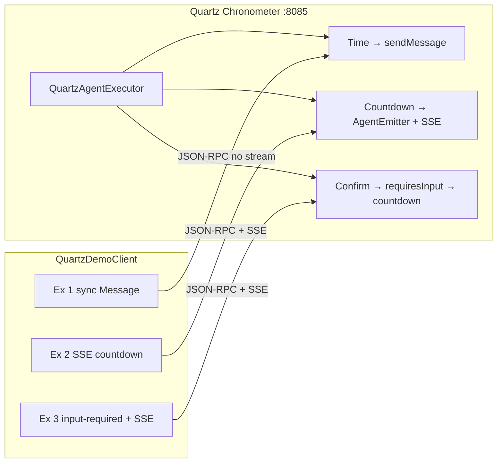

# Quartz Chronometer — design

**Status:** implemented  
**Code:** [`quartz-chronometer/`](../quartz-chronometer/)  
**Clockwork reference:** Part 5 — [`A2aDemoServer`](../src/main/java/local/a2a/examples/A2aDemoServer.java)

## Goal

Port **all three Clockwork examples** to the **default A2A HTTP JSON-RPC binding** using the official `a2a-java` SDK — without splitting the story into poll/SSE/push phases.

| Clockwork (Part 5) | Quartz Chronometer (Part 6) |
|--------------------|----------------------------|
| Hand-rolled `HttpServer` | Quarkus + `a2a-java-sdk-reference-jsonrpc` |
| Poll `GetTask` for all tasks | **SSE** for long-running tasks (normative HTTP streaming) |
| Three examples | **Same three examples** |

## Architecture

## Example → protocol mapping

| # | User prompt | Server response | Client observation |
|---|-------------|-----------------|-------------------|
| 1 | `What is the current time?` | `emitter.sendMessage(...)` | `MessageEvent` — **streaming off** |
| 2 | `Count down N seconds` | Task + `startWork` / `updateStatus` / `complete` | **SSE** — `streaming=true`, no poll loop |
| 3 | `Count down N seconds with confirm` | `requiresInput` → (client `confirm` on `taskId`) → countdown | **SSE** on same task after confirm |

**Principle:** use the **correct default mechanism per response shape** — immediate Message vs long-running Task — not three transport phases of the same countdown.

## Key classes

| Class | Role |
|-------|------|
| `QuartzAgentCardProducer` | Agent Card — three skills, `streaming: true` |
| `QuartzAgentExecutorProducer` | Routes prompts; `requiresInput` for Ex 3 |
| `QuartzCountdownRunner` | Shared countdown loop via `AgentEmitter` |
| `PendingConfirmRegistry` | Stores seconds while task waits in `input-required` |
| `QuartzMessageParser` | Same prompt parsing as Clockwork |
| `QuartzDemoClient` | Runs all three examples sequentially |

## Success criteria

- [x] Ex 1 returns immediate `Message` without creating a Task
- [x] Ex 2 streams countdown status over SSE (no `GetTask` poll loop)
- [x] Ex 3 creates task in `input-required`, resumes on `confirm`, then streams to completion
- [x] Agent Card lists three skills matching Clockwork
- [x] Unit tests for message parsing

## Limitations and out of scope

For the **Part 6 goal** — all three Clockwork examples on official JSON-RPC + SSE — the demo is complete. The gaps below are intentional simplifications, undemonstrated server features, or work left to other modules.

### Intentionally out of scope

| Missing | Where to look instead |
|---------|----------------------|
| **Push webhooks** | Legacy `bridge/` Phase C — [06-push-webhook.md](../docs/examples/06-push-webhook.md) |
| **`GetTask` poll baseline** | Legacy `bridge/` Phase A — [04-sdk-countdown-poll.md](../docs/examples/04-sdk-countdown-poll.md); Part 5 Clockwork |
| **Kafka / event backbone** | Part 8 — [`part8/`](../part8/), [08-kafka-task-events.md](../docs/examples/08-kafka-task-events.md) |
| **gRPC / REST bindings** | JSON-RPC only (`TransportProtocol.JSONRPC`) |
| **Benchmark / multi-transport** | [`benchmark/`](../benchmark/) |

Webhooks are **not required** for this module: the client stays connected and observes tasks via **SSE**. Push is for disconnected clients (background app, webhook receiver, orchestrator without a long-lived stream).

### Inherited from Clockwork (educational simplifications)

| Limitation | Detail |
|------------|--------|
| **Rule-based prompts** | `QuartzMessageParser` — keyword/number heuristics, not an LLM |
| **Fixed 10s tick interval** | `QuartzCountdownRunner` sleeps 10s between updates; countdowns **≤10s** show only *started* → *completed* (no mid-progress ticks) |
| **In-memory state** | Tasks, cancel flags, and `PendingConfirmRegistry` seconds are **lost on process restart** |
| **Single JVM** | No clustering, no durable task store |
| **No auth / TLS** | Localhost `:8085`, open Agent Card |
| **Narrow validation** | Unrecognized prompts return a help string, not rich structured errors |

### Implemented but not demonstrated

| Feature | Status |
|---------|--------|
| **`CancelTask`** | Server implements cancel in `QuartzAgentExecutorProducer`; **`QuartzDemoClient` never calls it** |
| **Poll fallback** | Client sets `polling: false`; no `GetTask` recovery if SSE drops mid-stream |

### Demo and client quirks

| Quirk | Detail |
|-------|--------|
| **Example 3 — two SSE sessions** | First `sendMessage` ends at `input-required`; the confirm follow-up opens a **new** SSE stream on the same `taskId`. Works in practice; server logs may show `SSE connection closed by client` between phases |
| **Agent Card URL** | Hardcoded `http://localhost:{port}` in `QuartzAgentCardProducer` — fine for local demos, not deployment-ready |
| **Thin test coverage** | Only `QuartzMessageParserTest`; no integration test for SSE streams or confirm continuation |
| **Sequential demo only** | `QuartzDemoClient` runs Ex 1 → 2 → 3 in one process; no separate CLI entry point per example |

### Compared to legacy `bridge/`

| Legacy `bridge/` | Quartz Chronometer |
|------------------|-------------------|
| Three **transport phases** for one countdown (poll → SSE → push) | Three **Clockwork examples**, each with the correct default protocol |
| Push webhook + Kafka wiring | None |
| Poll baseline for side-by-side comparison | No poll teaching path |

### Bottom line

Nothing essential is missing for the **Clockwork → official SDK + SSE** story. What is absent is **production hardening** (persistence, auth, cancel demo, poll fallback, webhooks, Kafka) and **transport variety** — deliberately left to `bridge/`, Part 8, and later scenarios.
