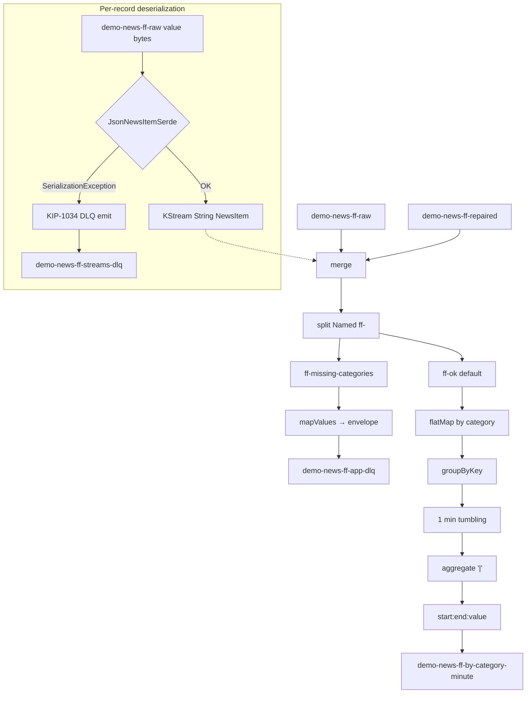
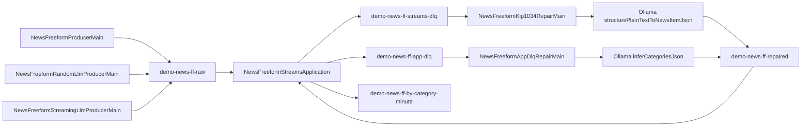

# Free-form news: topology, data flow, and LLM prompts

This document matches the Java in [`NewsFreeformTopology.java`](../src/main/java/local/kip1034/dlq/news/freeform/NewsFreeformTopology.java), [`NewsFreeformStreamsApplication.java`](../src/main/java/local/kip1034/dlq/news/freeform/NewsFreeformStreamsApplication.java), the producer mains under `freeform/`, and prompts in [`NewsLlmClient.java`](../src/main/java/local/kip1034/dlq/news/NewsLlmClient.java).

---

## 1. Free-form news (`NewsFreeformStreamsApplication` / `NewsFreeformTopology`)

Raw topic values may be **plain UTF-8 prose** or **`NewsItem` JSON**. The edge uses **`JsonNewsItemSerde`**: non-JSON text **throws** during deserialization → **`LogAndContinueExceptionHandler`** + **`errors.dead.letter.queue.topic.name`** → **`demo-news-ff-streams-dlq`** (KIP-1034 style: raw bytes + `__streams.errors.*` headers). Valid JSON with **empty categories** goes to **`demo-news-ff-app-dlq`** (JSON envelopes).

**Wire JSON:** canonical examples (valid `NewsItem`, serde failures, app DLQ envelopes, windowed `start:end:payload|…` strings) live in **[json-formats.md](json-formats.md)**. **Semantics** (repair seek-to-end, `LogAndContinue`, merge, test scope) are in **§5** of that file.

### `NewsFreeformProducerMain` (sample traffic, not LLM)

[`NewsFreeformProducerMain`](../src/main/java/local/kip1034/dlq/news/freeform/NewsFreeformProducerMain.java) does **not** call Ollama and has **no LLM prompt**. It publishes three records to **`demo-news-ff-raw`**:

1. **Key `ff-prose-1`** — plain text loaded from [`museum-demo-incident-sample.txt`](../src/main/resources/local/kip1034/dlq/news/freeform/museum-demo-incident-sample.txt) via **`FreeformSampleProse.museumDemoIncident()`** (edit that file to change the story).
2. **`ff-missing-1`** — valid `NewsItem` JSON with an **empty `categories`** array (exercises the app DLQ path).
3. **`ff-ok-1`** — valid JSON with categories `weather` and `local` (happy path).

### LLM producers (`generateSyntheticArticles`)

- **[`NewsFreeformRandomLlmProducerMain`](../src/main/java/local/kip1034/dlq/news/freeform/NewsFreeformRandomLlmProducerMain.java)** — asks Ollama for **`NEWS_RANDOM_COUNT`** (default 10) synthetic **`NewsItem`** JSON objects per run, in chunks of up to **`NewsLlmClient.maxSyntheticBatchSize()`** (40). Optional CLI args: `[count] [themeHint]`. Set **`NEWS_APPEND_FIXTURE_EDGE_CASES=true`** to append [`NewsFreeformFixtureEdgeCases`](../src/main/java/local/kip1034/dlq/news/freeform/NewsFreeformFixtureEdgeCases.java) (missing categories + `{ not json` for serde DLQ).

- **[`NewsFreeformStreamingLlmProducerMain`](../src/main/java/local/kip1034/dlq/news/freeform/NewsFreeformStreamingLlmProducerMain.java)** — same **`generateSyntheticArticles`** prompt in a loop: **`NEWS_LLM_BATCH_SIZE`**, **`NEWS_LLM_STREAM_INTERVAL_SEC`**, **`NEWS_LLM_STREAM_MAX_BATCHES`** (0 = until Ctrl+C). No DLQ fixtures.

Full prompt text for **`generateSyntheticArticles`** is in **§2.3** below.

### Topics

| Topic | Role |
|--------|------|
| `demo-news-ff-raw` | Prose or `NewsItem` JSON (bytes). |
| `demo-news-ff-repaired` | Valid JSON; merge source. |
| `demo-news-ff-streams-dlq` | **KIP-1034** DLQ (serde failures). |
| `demo-news-ff-app-dlq` | **Application** envelopes (`MISSING_CATEGORIES`). |
| `demo-news-ff-by-category-minute` | Windowed sink. |

### Streams topology (inside the JVM)

**`demo-news-ff-raw`** is written by any of the **producers** in §1 (fixed sample, random LLM burst, or streaming LLM loop). The diagram below shows **consumption** inside Streams once bytes reach the **`JsonNewsItemSerde`** edge.

Failed deserialization **does not** appear as a `KStream` record; the framework emits to **`demo-news-ff-streams-dlq`** before `merge`.



### End-to-end (two repair loops)



**Producers:** **`NewsFreeformProducerMain`** (fixed museum prose + JSON fixtures); **`NewsFreeformRandomLlmProducerMain`** / **`NewsFreeformStreamingLlmProducerMain`** (Ollama **`generateSyntheticArticles`** → valid `NewsItem` JSON on **`demo-news-ff-raw`**). All write to the same raw topic the Streams app consumes.

**Script:** [`scripts/demo.sh`](../scripts/demo.sh) — starts `ollama serve` if needed, optional `ollama pull`, flags `--skip-model-pull`, `--skip-ollama`. Default model in script: `llama3:latest`.

---

## 2. LLM prompts (`NewsLlmClient`)

**Repair mains** (`NewsFreeformKip1034RepairMain`, `NewsFreeformAppDlqRepairMain`) use **§2.1** and **§2.2**. **LLM producers** (`NewsFreeformRandomLlmProducerMain`, `NewsFreeformStreamingLlmProducerMain`) use **§2.3**. **`NewsFreeformProducerMain`** does not call Ollama.

All use **`POST {OLLAMA_URL}/api/generate`** with JSON `{"model","prompt","stream":false}`.

Environment: **`OLLAMA_URL`** (default `http://localhost:11434`), **`OLLAMA_MODEL`** (default `llama3:latest` in code).

<a id="llm-prompt-infer-categories"></a>

### 2.1 `inferCategoriesJson(NewsItem)`

**Callers:** `NewsFreeformAppDlqRepairMain` (`MISSING_CATEGORIES`, `BAD_JSON` path).

Let `input` = `NewsJson.stringify(item)` (full four-key JSON).

```
You label news for downstream topic grouping. Given JSON with keys articleId, heading, article, categories (array, may be empty). Output ONLY one JSON object with the SAME four keys. Fill categories with 1 to 6 short topical tags in English (nouns or short phrases, lowercase is fine). Do not copy the heading verbatim as the only tag. No markdown, no commentary.

Input:
<input>
```

**Timeout:** 120s. **Post-process:** `stripMarkdownFence`.

<a id="llm-prompt-structure-plaintext"></a>

### 2.2 `structurePlainTextToNewsItemJson`

**Callers:** `NewsFreeformKip1034RepairMain` (KIP-1034 DLQ bytes interpreted as UTF-8 prose). Signature: `structurePlainTextToNewsItemJson(articleIdHint, plainText)`.

`idRule` is either:

- If `articleIdHint` blank: `Use articleId as a short unique string (e.g. gen- plus random alphanumeric).`
- Else: `Use exactly this articleId string: ` + hint.

```
You structure news text for a Kafka Streams pipeline. Output ONLY one JSON object with keys articleId (string), heading (one line, <=120 chars), article (the story; you may lightly edit the source text for clarity), categories (array of 1-5 short topical English tags). <idRule> Your entire reply MUST start with { as the first non-whitespace character — no preamble, no markdown fences, no "Here is" text.

Source text:
<plainText>
```

**Timeout:** 240s. **Post-process:** `stripMarkdownFence`, then `isolateLeadingJson` (leading `{` / `[`).

<a id="llm-prompt-synthetic-articles"></a>

### 2.3 `generateSyntheticArticles`

**Callers:** `NewsFreeformRandomLlmProducerMain`, `NewsFreeformStreamingLlmProducerMain` (`count` capped at 40 per call). Signature: `generateSyntheticArticles(count, themeHint)`.

Let `n` = bounded count. Let `theme` = hint or default `mixed beats worldwide (science, business, local politics, sport, culture, environment)`.

```
You invent plausible but fictional news briefs for a Kafka Streams QA demo. Output ONLY a JSON array of exactly <n> objects. No markdown fences, no text before or after the array. Each object MUST have keys: articleId (string, unique across the array), heading (one line, <=120 chars), article (1–4 sentences), categories (array of 1–5 short topical English tags; invent tags freely, no fixed list). Vary tone and region; avoid repeating the same headline pattern. Bias topics toward: <theme>.
```

**Timeout:** 420s. **Post-process:** `stripMarkdownFence`, `parseSyntheticArticles` / `isolateLeadingJson`.
